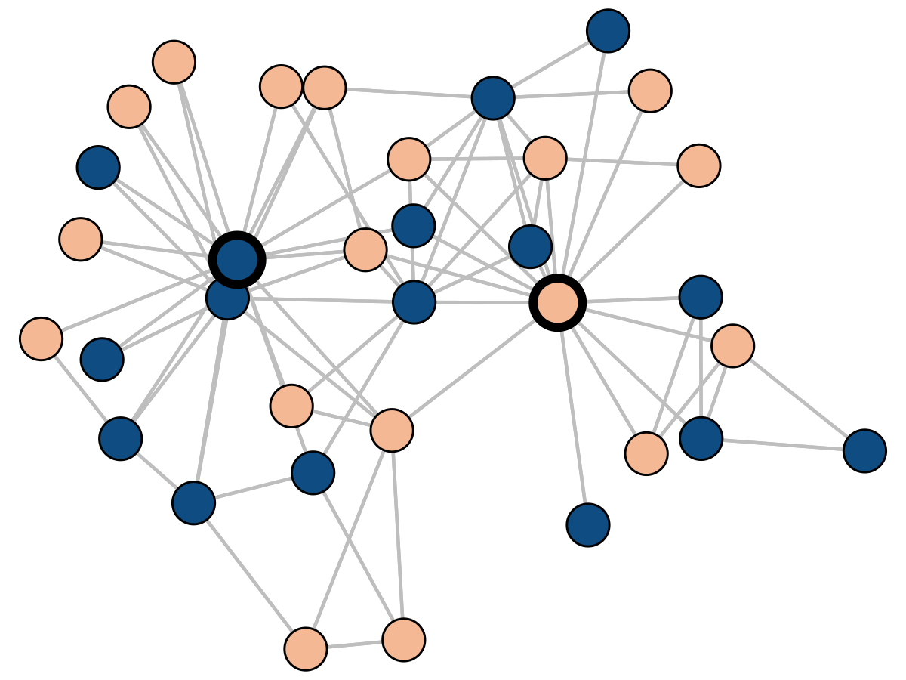

exclude: true   
<style type="text/css">
code.r{ 
  font-size: 16px; 
}
pre {
  font-size: 16px !important;  
}
</style>
```{r setup, include=FALSE}
options(htmltools.dir.version = FALSE)
```

---
class: split-50 bg-main1 
layout: false 
 
.row[ 
.split-three[
.column[<br><br>
   
  ]
.column[<br><br>
   
]
.column[<br><br>
     
] 

]
]
.row[ 
.split-three[
.column[<br>
  .font_large[.alert-no-bold[<nobr>Heather Z. Brooks</nobr>]]
  <nobr>Mathematics</nobr> <br> Harvey Mudd
  .alert2[@HZinnbrooks]
]  
.column[<br>
  .font_large[.alert-no-bold[<nobr>Mason Porter</nobr>]]
   Mathematics <br> UCLA      
   .alert2[@masonporter]
]
.column[<br>
  .font_large[.alert-no-bold[<nobr>Phil Chodrow</nobr>]]
  <nobr>Mathematics</nobr> <br> UCLA
  <br> .alert2[@PhilChodrow] <br>
]
]
]

---

class: split-two
layout: true

.column.bg-main1[

## A Class of Networked Opinion Models

<br> 
Each agent $i$ has opinion $x_i \in [-1, 1]$. 

For today, we'll assume two .alert2[zealots] $x_- = -1$ and $x_+ = 1$ whose opinions don't change (thick borders). 

Continuous-time update: 


$$\dot{x}_i = \frac{\sum_{j \sim i}\color{#FFE1A8}{w}(x_i,x_j)(x_j - x_i)}{\sum_{j \sim i}\color{#FFE1A8}{w}(x_i, x_j)}$$

Here, $\color{#FFE1A8}{w}$ is an .alert[influence kernel] that controls how nodes respond to other nodes based on their opinions.  


]
.column[
  {{content}}
]

---

---

class: 

## Consensus Dynamics 

Set $w(x_i, x_j) = 1$, giving 

$$\dot{x}_i = \frac{1}{d_i}\sum_{j \sim i}(x_j - x_i)\;.$$

**Harmonic extension theorem**: there is a unique, stable stationary state. 


---

class: 

## Bounded Confidence

Set 
$$
w(x_i, x_j) = 
\begin{cases}
  1 & \quad \left|x_j - x_i\right| < c\\
  0 & \quad \text{otherwise.}
\end{cases}
$$ 

Agents only interact with other agents if they are sufficiently close in opinion ("bounded confidence"). 

This is **continuous-time Hegselmann-Krause (HK) dynamics.**

---

class: 

## Bounded Confidence

Set 

$$
w(x_i, x_j) = 
\begin{cases}
  1 & \quad \left|x_j - x_i\right| < c\\
  0 & \quad \text{otherwise.}
\end{cases}
$$ 

**Arbitrarily many** neutrally stable states for small $c$. 




---

layout: true

## Interpolating the Influence Function

{{content}}

---


---


---

layout: false 
class: split-40

.column.bg-main1[

  ### Sigmoid Interpolation

  <br> <br> <br> 

  $$w(x_i, x_j) = \frac{1}{1 + e^{\color{#FFE1A8}{\gamma}(x_i - x_j)^2 - \color{#FFE1A8}{\gamma}\color{#73C3C4}{\delta}}}$$

  - $\color{#FFE1A8}{\gamma}$ controls the .alert[steepness] of the curve. 
  - $\color{#73C3C4}{\delta}$ is analogous to the .alert2[confidence threshold] in the HK model. 


]

.column[
  <br> <br> <br> <br> <br> <br> 
  
]

---
class: bg-main1

# Questions for Today

<br> 
.font_large[
1. For .alert[small] $\color{#FFE1A8}{\gamma}$, do the stationary states resemble those of consensus dynamics? 
{{content}}
]
--
  - Yes! 
{{content}}
--
1. For <span class="alert">large</span> $\color{#FFE1A8}{\gamma}$, do the stationary states resemble those of Hegselmann-Krause? 
{{content}}
--
  - Mostly?  
{{content}}
--
3. What happens <span class="alert2"> in between</span>?
{{content}}
--
  - Fun stuff!  
---


## Small $\gamma$ behaves like consensus dynamics

<br> <br> <br>

.font_large[
**Theorem (HZB, PSC, MAP '22)**: For sufficiently small $\gamma \geq 0$, there is a unique stationary state $\mathbf{\bar{x}}(\gamma)$, and this state is continuous as a function of $\gamma$. 

**Proof**: Direct implication from the implicit function theorem. 
]

---

layout: false
background-image: url(../img-lib/nonlinear-opinion-dynamics/karate.png)
background-size: contain

---

## Large $\gamma$ behaves like Hegselmann-Krause

<br>

.font_large[
**Theorem (HZB, PSC, MAP '22)**: As $\gamma \rightarrow \infty$, it holds that any stationary state of our model can be made arbitrarily close to some HK stationary state. 

**Proof**: Relies on the fact that the dynamical update operator is continuous in both $\gamma$ and the opinion state vector $\mathbf{x}$. 

***We're not sure*** whether any HK stationary state can be approximated this way. 
]


---
class: 
layout: true


.split-three[
  .column[
  ### Small $\gamma$

  <br> 
  Consensus-like.

  Unique stationary state.

  <br> <br> 
  
  ]
  .column[.content[
  ### In between <br> <br> <br> <br> <br> 
  **Bifurcations ahoy!** 

  <br> <br> <br> <br><br><br><br>

  *But we'll focus on one specific case.*
  ]
  ]
  .column[
  ### Large $\gamma$
  <br> 
  Bounded-confidence-like.

  Many stationary states.

  
  
  ] 
]


---
class: hide-col2
---
class:

---

class: split-two
layout: true

.column.bg-main1[
## Opinion States and Graph Structure
<br> 

.font_large[
*"The stability of an opinion state depends in part on its alignment with the underlying graph topology."* 
]

This *feels right*, but is .alert[surprisingly difficult to express] in common models. 

]
.column[

{{content}}

]

---

---
class: 

<br> <br> <br> <br> 

Consensus dynamics: only one stationary state, question is moot. 


 
---

<br> <br> <br> <br> 

Bounded confidence (HK): most stationary states are *neutrally stable*.


Also, lots of stable states that don't align with graph topology. 

---

layout: true 

<br> <br> <br> 

**Theorem (HZB, PSC, MAP '22)**: Let $u = w(0, 0)$ and $v= w(0,1)$. Suppose that every node is connected to both zealots, and suppose that the graph of persuadable nodes is regular (all nodes have same degree). Then: 
- $\bar{\mathbf{x}} = \mathbf{0}$ is a stable stationary state. 
- The space of unstable directions at $\bar{\mathbf{x}}$ is spanned by the eigenvectors of the graph Laplacian with eigenvalues satisfying 

$$\lambda \leq - \frac{2v(1 - 2\gamma(1-v))}{u}\;.$$ 

{{content}}

---
class: 

**Proof**: Relatively direct (though slightly grubby) computation of the Jacobian at $\bar{\mathbf{x}}$. 

---
class: 

Unstable directions that emerge first: 

1. $\mathbf{v}_1 = \mathbf{1}$ perturbs all nodes equally in the direction of one of the two zealots. 
2. $\mathbf{v}_2$ is the *Fiedler eigenvector* that is often interpreted as containing community structure. 

The *persistent disagreement* state that emerges first is aligned with $\mathbf{v}_2$.     

---

layout: false
background-image: url(../img-lib/nonlinear-opinion-dynamics/paired-cliques-misaligned.png)
background-size: contain

---

background-image: url(../img-lib/nonlinear-opinion-dynamics/paired-cliques-aligned.png)
background-size: contain
layout: false

---

class: split-40

.column.bg-main1[
# Summing Up

<br><br><br><br><br> 
We used a simple logistic sigmoid to interpolate the influence kernels in two well-known opinion models. 
]

.column[<br><br><br><br><br><br>
  
]

---

class: split-40

.column.bg-main1[
# Summing Up

<br><br><br><br><br> 
This interpolation recovers equilibrium behavior of both extremal models in suitable limits. 
]

.column[<br><br><br><br><br>
  
]

---

class: split-40

.column.bg-main1[
# Summing Up

<br><br><br><br>
This interpolation allows analytic treatment of the relationship between .alert[graph topology] and .alert2[dynamical stability] of opinion states. 
]

.column[<br><br><br>
.centered[
  
]
]

---

class: split-40

.column.bg-main1[
# Summing Up

<br><br><br><br>
This interpolation allows analytic treatment of the relationship between .alert[graph topology] and .alert2[dynamical stability] of opinion states. 

There's some complex structure in the equilibria of even simple cases. Lots more to learn! 
]

.column[<br><br><br>
.centered[
  
]
]

---

class: split-50

.column.bg-main1[
# Thanks!


.alert[Awesome organizers]

- Olivia Chu
- Daniel Cooney
- Chadi Saad-Roy

.alert[Awesome collaborators]

.split-two[
.column[.lil-stretch[<br><br><br><br><br><br><br><br><br><br><br><br><br>
   
  .alert[**Heather Zinn Brooks**] <br> Harvey Mudd 
  ]
  ]
.column[
  .lil-stretch[<br><br><br><br><br><br><br><br><br><br><br><br><br>
   
  .alert[**Mason Porter**] <br> UCLA
  ]
]]
]

.column[<br><br><br><br><br><br><br><br>
# Questions?
]


