exclude: true   
<style type="text/css">
code.r{ 
  font-size: 16px; 
}
pre {
  font-size: 16px !important;  
}
</style>
```{r setup, include=FALSE}
options(htmltools.dir.version = FALSE)
```

```{r run, eval=FALSE, include=FALSE}
# xaringan::inf_mr("middlebury-2022/index.rmd")
``` 


---

layout: false
class: split-two

.column.bg-main1[
  ### The Hypergraph Clustering Problem 

  Given some hypergraph data, assign each node to a .alert[*cluster*] of related nodes. 
  <br> <br>
  Emphasis for today: .alert[spectral algorithms] and conjectured .alert[theoretical limits]. 

  .alert2[Preprint]: <br>
  <b>PSC</b>, N. Eikmeier, J. Haddock, (2022). Nonbacktracking spectral clustering of nonuniform hypergraphs, <i>Forthcoming in SIMODS; arXiv:2204.13586</i>

  
  
]

  
]
.column[.content.vmiddle[.stretch[
  
]]]

---


layout: false
class: split-two

.column.bg-main1[
### The Generative Approach

We treat this problem as (approximate) inference in a *stochastic blockmodel*. 

- Nodes have true label vector $\mathbf{z} \in \mathcal{Z}^n$, where $\mathcal{Z}$ is a discrete label alphabet.
- Edges form on subset $R \subset 2^\mathcal{N}$ of nodes with rate $\Omega(\mathbf{z}_R)$, where $\Omega$ is an *affinity* function that encodes dependence of edges on node labels. 

For example, we might expect edges to form at higher rates between nodes with the same label:  

$$\Omega(\color{#ff5252}{\bullet}, \color{#ff5252}{\bullet}, \color{#ff5252}{\bullet}) > \Omega(\color{#ff5252}{\bullet}, \color{#6CAE75}{\bullet}, \color{#FFD740}{\bullet}) $$
  
  
]

  
]
.column[.content.vmiddle[.stretch[
  
]]]


---

class: 

### A Testbed for Sparse Hypergraph Clustering

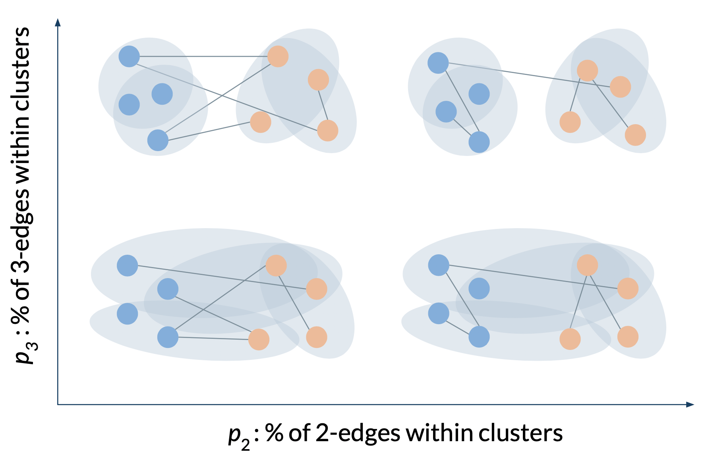


---

class: split-two
layout: true

.column[

## 

<br> <br>
   
]

.column[.stretch[.font_smaller[
  {{content}}
]]]


---

   

---

## Modularity Objective

Proposed approach: minimize the objective

$$Q(\mathbf{z}) = \sum_{k \in \text{edge sizes}} \color{#ff5252}{\beta_k} \left[\mathbf{cut}_k(\mathbf{z}) + \color{#ff5252}{\gamma_k} \sum_{\ell \in \mathcal{Z}} \mathbf{vol}(\ell)^k \right]$$

where: 

- $\mathbf{cut}_k(\mathbf{z})$ is the number of $k$-edges with inhomogeneous labels under label vector $\mathbf{z}$
- $\mathbf{vol}(\ell)$ is the sum of degrees in community $\ell$. 
- $\color{#ff5252}{\beta_k}$ and $\color{#ff5252}{\gamma_k}$ are parameters that can be estimated given a proposed labeling $\mathbf{z}$. 

---

## Modularity Objective

Proposed approach: minimize the objective

$$Q(\mathbf{z}) = \sum_{k \in \text{edge sizes}} \color{#ff5252}{\beta_k} \left[\mathbf{cut}_k(\mathbf{z}) + \color{#ff5252}{\gamma_k} \sum_{\ell \in \mathcal{Z}} \mathbf{vol}(\ell)^k \right]$$

Algorithm: alternate between estimating $\mathbf{z}$ (generalized Louvain) and the parameters $\beta_k$ and $\gamma_k$. 

The best thing about this algorithm is that it is fast and scalable...not necessarily *accurate*... 

---

## Modularity Objective

<br>
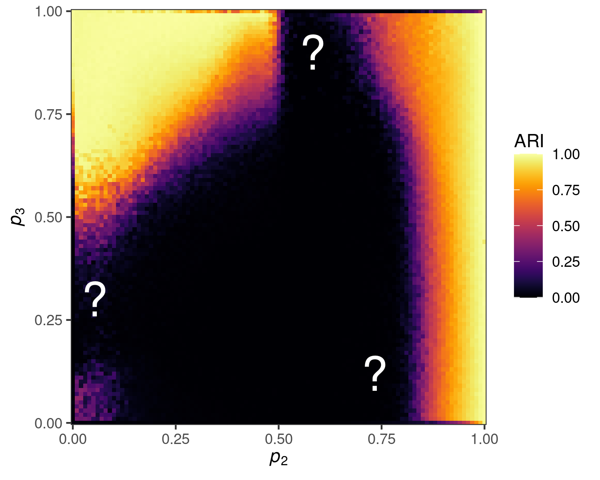   

Adjusted Rand Index (ARI): 

- ARI = 1: perfect clustering. 
- ARI = 0: random noise.


---

class: split-two
layout: false

.column.bg-main1[
# **The Team**
.row[ 
.split-two[
.column[.lil-stretch[<br><br><br><br><br><br> 
   
  .alert[**Nicole Eikmeier**] <br> Computer Science <br> Grinnell 
  ]
  ]
.column[
  .lil-stretch[<br><br><br><br><br><br>
   
  .alert[**Jamie Haddock**] <br> Mathematics <br> Harvey Mudd 
  ]
]]]


]

.column[ 
.stretch[
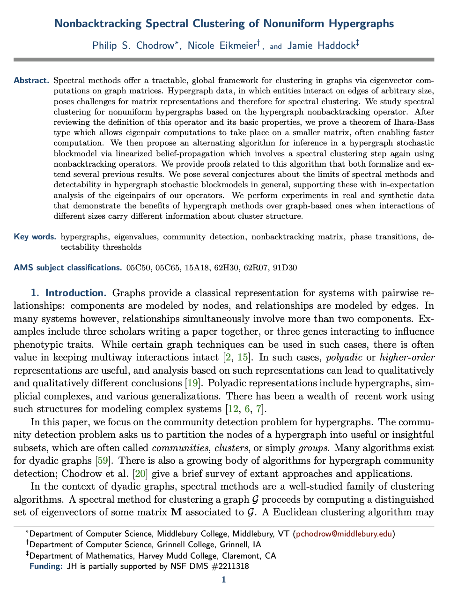 
]
]

---

class: split-two

.column.bg-main1[
  ### What We Know About Graphs

Random graph (stochastic blockmodel) with two groups. 

Nodes have on average $a$ neighbors within-cluster and $b$ neighbors between clusters. 

.alert[Theorem]: Finding clusters correlated with ground-truth is possible as number of nodes $n\rightarrow \infty$ iff

$$\frac{1}{2}\frac{(a - b)^2}{a + b} > 1\;.$$

.footnote[
  Conjecture by Decelle et al., *PRE* 2012. <br>
  Proof by Mossel et al., *Combinatorica* 2018. 
]

]
.column[.content.stretch[
  <br> 
  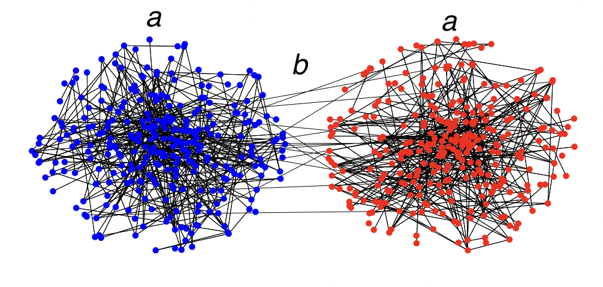
  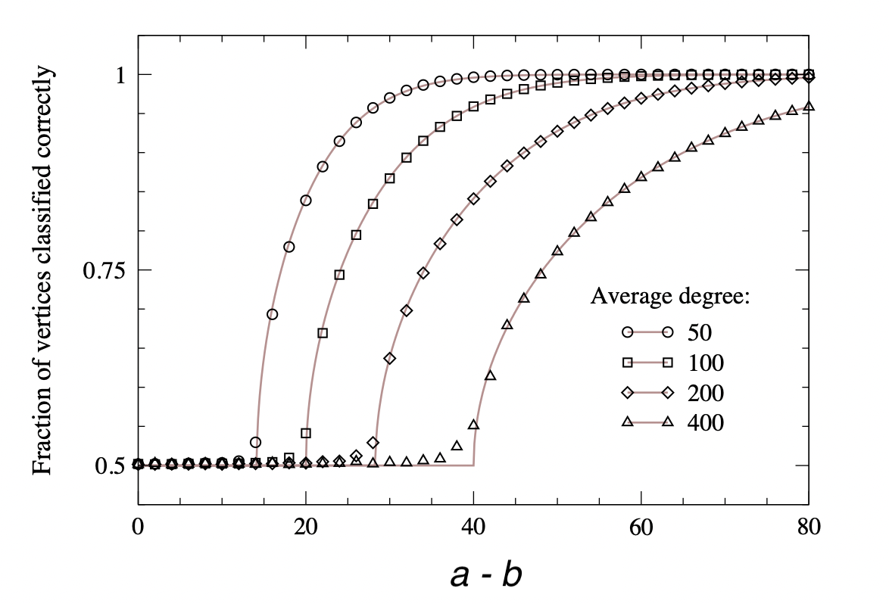
  
]
.footnote[
  Images from Nadakuditi + Newman, *PRE* 2012 <br> Abbe et al., *IEEE Trans. Info. Theory* 2014. 
]
]

---

class: split-two

.column.bg-main1[
  ### What We Know About Graphs


.alert[Theorem]: Finding clusters correlated with ground-truth is possible as number of nodes $n\rightarrow \infty$ iff

$$\frac{1}{2}\frac{(a - b)^2}{a + b} > 1\;.$$

Furthermore, there exist .alert2[matrix methods] that are asymptotically optimal, in the sense that they can find clusters correlated with ground truth whenever this is asymptotically possible. 

.footnote[
  Conjecture by Decelle et al., *PRE* 2012. <br>
  Proof by Mossel et al., *Combinatorica* 2018. 
]

]
.column[.content.stretch[
  <br> 
  
  
  
]
.footnote[
  Images from Nadakuditi + Newman, *PRE* 2012 <br> Abbe et al., *IEEE Trans. Info. Theory* 2014. 
]
]


---

class: split-two
layout: false

.column.bg-main1[

### Matrices for Hypergraphs? 

We could transform the hypergraph into a graph.
- .alert[Problem]: loses multi-way information.

We could construct a set of adjacency tensors $\mathbf{A}^{(2)}$, $\mathbf{A}^{(3)}$, $\mathbf{A}^{(4)}$...

$$a^{(3)}_{ijk} = \begin{cases} 1 &\quad (i,j,k)\in \mathcal{E} \\ 0 &\quad \text{otherwise...}\end{cases}$$

- .alert[Problem]: we know eigenvectors of tensors, but not .alert[*sets*] of tensors.

So, what should we do?....


]

.column[
  <br> <br>
  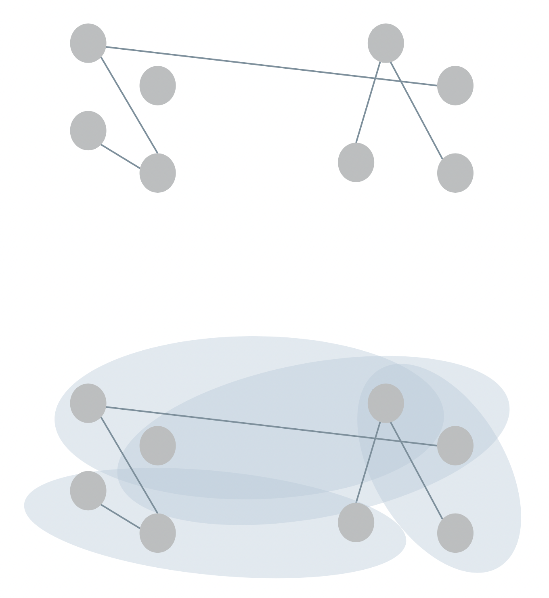
]


---

class: split-two
layout: false


.column.bg-main1[
## The Nonbacktracking Operator

<!-- The adjacency matrix is $n\times n$ and  operates on nodes.  -->

The .alert[nonbacktracking operator] $\mathbf{B}$ is a matrix that operates on *edge-node pairs*. 

Define relation $(e_1, v_1) \rightarrow (e_2, v_2)$: 

- $v_1 \in e_1$ and $v_2 \in e_2$
- $v_1 \in e_2 \setminus v_2$
- $e_1 \neq e_2$

.font_smaller[ .font_smaller[
$$\mathbf{B}[(e_1, v_1), (e_2, v_2)] = \begin{cases} 1 &\quad (e_1, v_1) \rightarrow (e_2, v_2) \\ 
0 &\quad \text{otherwise.}\end{cases}$$
]]
.footnote[.font_smaller[
  Proposed for hypergraphs by Storm (2006). "The zeta function of a hypergraph," *The Electronic Journal of Combinatorics*. 
]]
]


.column[
<br>
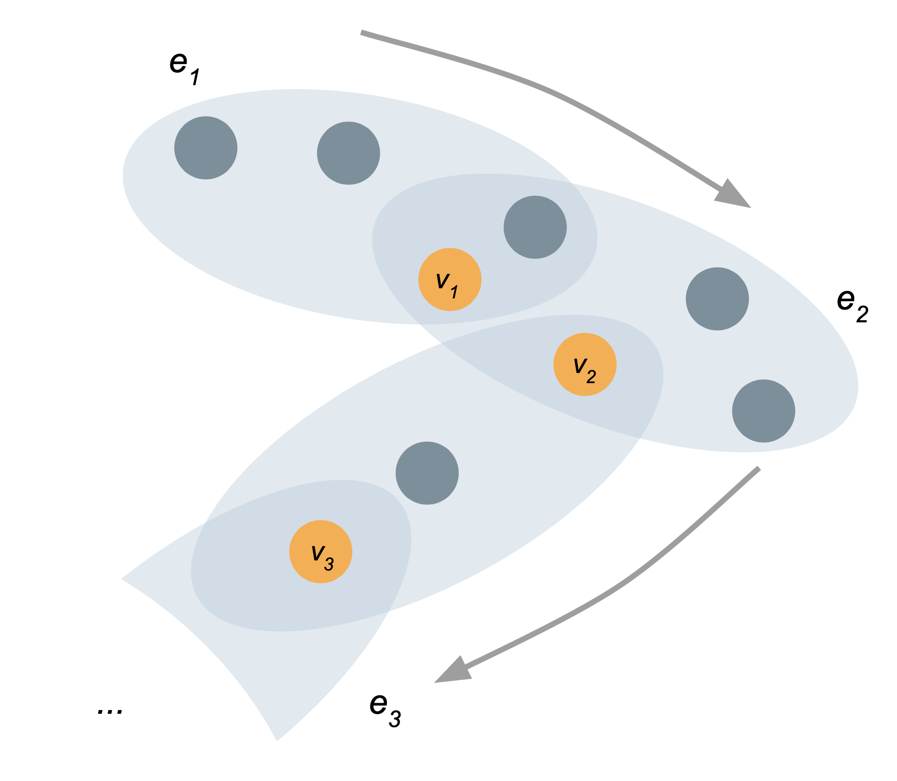

"I can get to $v_2 \in e_2$ from $e_1$ by passing through $v_1$. I can get to $v_3 \in e_3$ from $e_2$ by passing through $v_2$..."

]

???

The important intuition here is: 

- We can imagine a walk stepping from a node to a hyperedge and on to a new node, and on to a new hyperedge, and so on. 
- The conditions ensure that we never hit the *same* node or the *same* hyperedge in consecutive steps. 

---

class: split-two


.column.bg-main1[

<br> <br> 
**.alert[Theorem] (PSC, JH, NE '22)**: In a random graph (stochastic blockmodel) with two equal-sized clusters, within-cluster $k$-degree $a_k$ and between-cluster $k$-degree $b_k$, the nonbacktracking operator $\mathbf{B}$ has, in expectation, an eigenpair $(\beta, \mathbf{v})$ where 

$$
\beta = \frac{1}{2}\sum_{k \in \text{edge sizes}} (a_k - b_k)\;,
$$
such that $\mathbf{v}$ is correlated with clusters. 


.footnote[
    Stronger version for uniform hypergraphs proven by <br> 
    Stephan and Zhu (2022) Sparse random hypergraphs: Non-backtracking spectra and community detection, <i> arXiv:2203.07346</i>
]
]

.column[
  <br> <br> <br> 
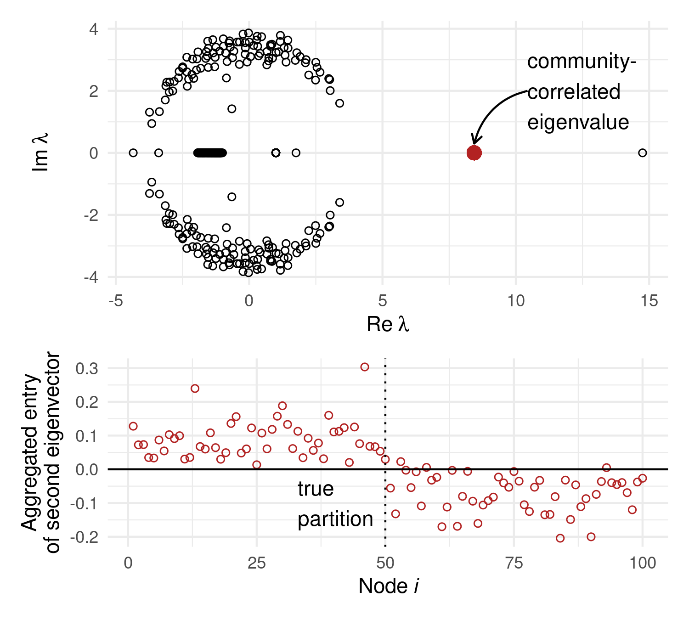
]

---

class: split-two
layout: false


.column.bg-main1[
## Issue: Computation

<br>
$\mathbf{B}$ is indexed by edge-node pairs. 

So, $\mathbf{B}$ is of size $m\langle k\rangle \times m\langle k\rangle$, where $m$ is the number of edges and $\langle k \rangle$ is the average edge size. 

A .alert[*small*] data set might have $n = 300$ nodes, $m = 8,000$ edges, and average edge size $2.5$. 

$m\langle k \rangle = 8,000 \times 2.5 = 20,000$, which is already a pretty big matrix. 

Eigenpair computations get expensive fast...

]

.column[.content.vmiddle[.stretch[
   
]]]

---

class: bg-main
layout: false

## A Generalized Ihara-Bass Theorem

**Theorem (PSC, JH, NE '22)**: Under mild conditions, if $\lambda$ is an eigenvalue of $\mathbf{B},$ then either: 

1. $\lambda \in \{1, -1, -2, \ldots, 1-\bar{k}\}$ and carries no structural information about the hypergraph, or
2. $\lambda$ is an eigenvalue of the matrix 

$$
\mathbf{B}' = \left[\begin{matrix}
  <!-- \mathbf{0} & \mathbb{D} - \mathbf{I}_{\bar{k}n} \\ -->
  <!--   (\mathbf{I}_{\bar{k}}- \mathbf{K}) \otimes \mathbf{I}_n &  \mathbb{A} + (2\mathbf{I}_{\bar{k}} - \mathbf{K})\otimes \mathbf{I}_n -->
\end{matrix}\right] \in \mathbb{R}^{2\bar{k}n\times 2\bar{k}n}\;.
$$

.font_smaller[.font_smaller[
- $\bar{k}$ is the number of distinct edge sizes, $n$ is the number of nodes. 
- $\mathbb{A} \in \mathbb{R}^{\bar{k}n\times \bar{k}n}$ collects adjacency information for each hyperedge size.
- $\mathbb{D} \in \mathbb{R}^{\bar{k}n\times \bar{k}n}$ collects node degrees for each hyperedge size. 
- $\mathbf{K} \in \mathbb{R}^{\bar{k}\times \bar{k}}$ lists possible edge sizes. 
- $\mathbf{I}_{\ell} \in \mathbb{R}^{\ell\times \ell}$ is the matrix identity of size $\ell$. 
- $\otimes$ is the Kronecker product. 
]]


---

class: 

## Proof Sketch

1. $\mathbf{B}$ can be written as $\mathbf{S}\mathbf{T} - \mathbf{R}$ for suitable operators $\mathbf{S}$, $\mathbf{T}$ and $\mathbf{R}$, which also satisfy handy relations like $\mathbf{T}\mathbf{S} = \mathbb{A}$.  
2. Consider $\det(\lambda\mathbf{I} - \mathbf{B})$, substitute $\mathbf{B} = \mathbf{S}\mathbf{T} - \mathbf{R}$, and use the *push-through identity*:
$$
\det(\mathbf{X + \mathbf{Y}\mathbf{Z}}) = \det(\mathbf{X}) \det(\mathbf{I} + \mathbf{Z}\mathbf{X}^{-1}\mathbf{Y})
$$
(*provided all inverses, sums, and products are defined*). 
3. Simplify, obtaining
$$
\det(\lambda \mathbf{I} - \mathbf{B}) = \det(\lambda\mathbf{I} - \mathbf{B}')\det(\text{uninformative part})\,.
$$ 


.footnote[Approach based on a proof of the the graph Ihara-Bass formula in: <br> M. C. Kempton (2016). Non-backtracking random walks and a weighted Ihara’s theorem. *Open Journal of Discrete Mathematics* 6, 207-226
]


---

class: split-two
layout: false


.column.bg-main1[
## Issue: Computation

<br> <br> 
A .alert[*small*] data set might have $n = 300$ nodes, $m = 8,000$ edges, and average edge size $2.5$. 

<br> 
If $\bar{k} = 3$, then we can compute eigenvectors in 

$$2n\bar{k} = 1,800 \ll 20,000 = m\langle k\rangle$$ 

dimensions instead.

We can do that 100x-1,000x faster! 
]

.column[.content.vmiddle[.stretch[
   
]]]

---

class: split-two
layout: true

.column.bg-main1[

## First Algorithm

  
<br>

  2. Compute the second eigenpair $(\lambda_2, \mathbf{v}_2)$ of $\mathbf{B}'$. 
  3. If $\lambda_2$ is real, separate $\mathbf{v}_2 = (\alpha, \beta)$, with $\alpha, \beta \in \mathbb{R}^{n\bar{k}}$. 
  4. If
     $$u_i = \sum_{k = 1}^{\bar{k}}\alpha_{ik} < 0\;,$$
    assign $i$ to cluster $A$, else assign $i$ to cluster $B$. 

]

.column[.content.vmiddle[.stretch[
{{ content }}
]]]

---

class: split-two


   

---

class: split-two
layout: true

.column[

## Synthetic Testbed

<br> <br>
   
]

.column[.stretch[ 
  {{content}}
]]


???

This project had a pretty specific motivation. Last year, I published with two wonderful collaborators a paper in which we proposed a **new set of algorithms** for hypergraph community detection. 

We got great results on data, but when we tried it on a certain experiment involving *synthetic* data, we got some results which were, to use the scientific term, **pretty weird-looking.** 

... 

So, my story for you today is a story about **filling in the gaps**.


---

class: split-two
layout: true

.column[

## Synthetic Testbed

<br> <br>
   
]

.column[.stretch[ 
  {{content}}
]]


---

## Louvain Algorithm

<br>
   

Adjusted Rand Index (ARI): 

- ARI = 1: perfect clustering. 
- ARI = 0: random noise.


---

## Spectral Algorithm

<br>
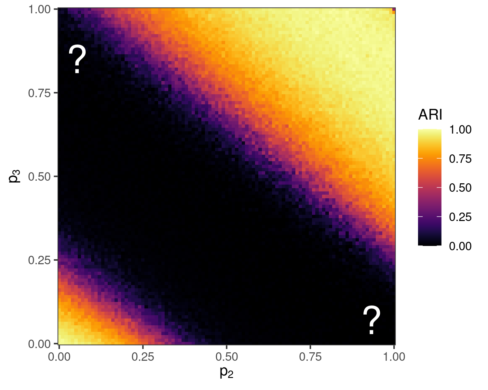   

Adjusted Rand Index (ARI): 

- ARI = 1: perfect clustering. 
- ARI = 0: random noise.

---

class: split-two
layout: false

.column.bg-main1[
  ## Belief Propagation...

  <br>

  
]

---

class: split-two
layout: false

.column.bg-main1[
  ## Belief Propagation...

  <br>

  ...is the "cavity method" of statistical physics. 

  
]

---

class: split-two
layout: false

.column.bg-main1[
  ## Belief Propagation...

  <br>

  ...is the "cavity method" of statistical physics. 
 
  ...is an approximate method for ~~statistical inference~~ Machine Learning.®

  
]

---

class: split-two
layout: false

.column.bg-main1[
  ## Belief Propagation...

  <br>

  ...is the "cavity method" of statistical physics. 

  ...is an approximate method for ~~statistical inference~~ Machine Learning.®

  ...is a discrete-time dynamical system.  
]

---

class: split-two
layout: false

.column.bg-main1[
  ## Belief Propagation...

  <br>

  ...is the "cavity method" of statistical physics. 

  ...is an approximate method for ~~statistical inference~~ Machine Learning.®

  ...is a discrete-time dynamical system.  
]

.column[

<br> 
Formally, iterate these updates to convergence: 
<br> 
\begin{align}
\mu_{iR}^{(s)} &\gets \frac{1}{Z_{iR}}\prod_{Q \in \binom{[n]}{|R|}\setminus R} \nu_{Qi}^{(s)} \\ 
\nu_{Ri}^{(s)} &\gets \frac{1}{Z_{Ri}}\sum_{\mathbf{z}:z_i = s}\mathbb{P}(a_R| \mathbb{z}_R)\prod_{j \in R\setminus i} \mu_{jR}^{(z_j)}
\end{align}

.font_smaller[  
$\mu_{iR}^{(s)}$ is "node $i$'s confidence that it belongs to community $s$ based on other nodes in tuple $R$."

$Z_{iR}$ and $Z_{Ri}$ are normalization constants. 

$\mathbb{P}(a_R|\mathbb{z}_R)$ is our stochastic blockmodel: specifies how likely there are to be $a_R$ edges on tuple $R$ given some community labels $\mathbf{z}_R.$ 
]
]

---

class: split-two

.column.bg-main1[

### A Linear Approximation

.font_smaller[
**Theorem (PSC, NE, JH '22):** Consider a stochastic blockmodel in which: 

- Every node has the same expected number of attached edges. 
- The expected degree does not depend on the number of nodes $n.$ 

Then: 

- BP has an approximate fixed point $\bar{\mathbf{x}}$ that contains no cluster information. 
- The Jacobian derivative $\mathcal{J}(\bar{\mathbf{x}})$ of the BP dynamics around $\bar{\mathbf{x}}$ has $O(n^{-1})$ entries, except for a block of the form 

$$\mathbf{J} = \sum_{k = 1}^{\bar{k}} \mathbf{C}_k \otimes \mathbf{B}_k + O(n^{-1})\;.$$
]
]

--

.column[
  

  

<br> <br> <br> <br> 

- $\mathbf{C}_k$ is a matrix of parameters that depends on the stochastic blockmodel $\mathbb{P}$. 
- $\mathbf{B}_k$ is our friend the Hashimoto operator, restricted to edges of size $k$. 
- $\otimes$ is the Kronecker product. 


.footnote[
  Result argued heuristically for graphs in: <br>
  <br> Krzakala et al. (2013)  Spectral redemption in clustering sparse networks, <i>PNAS</i> 110 (52) 20935-20940
]
] 

<!-- ---

background-image: url(img/algorithm-demo.png)
background-size: contain

### Belief-Propagation Spectral Clustering

<br> <br> <br> <br> <br> <br> <br> <br> <br> <br> <br> <br> <br>  Real leading eigenvectors of $\mathbf{J}$ contain cluster information!  -->


---

class: split-two bg-main4

# A Cheat

$\mathbf{J}$ can be a *very* large matrix. 

As before, we can use a smaller one: 

**Theorem (PSC, JH, NE '22)**: Under mild conditions, if $\lambda$ is an "interesting" eigenvalue of $\mathbf{J},$ then $\lambda$ is also an eigenvalue of the $2n\ell\bar{k}$ matrix

.font_smaller[.font_smaller[
$$\mathbf{J}' = (\mathbf{I}_2\otimes \mathbf{G} \otimes \mathbf{I}_n) \left[\begin{matrix} 
\mathbf{0} & \mathbf{I}_\ell \otimes \mathbb{D} \\ 
\mathbf{0} & \mathbf{I}_\ell \otimes \mathbb{A}
\end{matrix}\right] - (\mathbf{I}_2\otimes \mathbf{H} \otimes \mathbf{I}_n) \left[\begin{matrix} 
\mathbf{0} & \mathbf{I}_{\ell \kappa n}  \\ 
\mathbf{I}_\ell \otimes (\mathbf{K} - \mathbf{I}_{\bar{k}-1}) & \mathbf{I}_\ell \otimes (\mathbf{K} - 2\mathbf{I}_{\bar{k}-1})
\end{matrix}\right] \otimes \mathbf{I}_n$$
]]

where $\ell$ is the number of communities and $\mathbf{G}$, $\mathbf{H}$ hold statistical parameters. 

*Proof is a little messier this time.*

---

class: split-two
layout: false


.column.bg-main1[
### Belief-Propagation Hypergraph Spectral Clustering

We can approximate belief-propagation by considering the spectrum of the matrix 

$$\mathbf{J} = \sum_{k = 1}^{\bar{k}} \color{#ff5252}{\mathbf{C}_k} \otimes \mathbf{B}_k + O(n^{-1})\;.$$

or its smaller relative $\mathbf{J}'$. 
]

.column[
  ## Alternating Algorithm

  1. Start with initial guess for the parameter matrices $\color{#ff5252}{\mathbf{C}_k}$. 
  2. Form $\mathbf{J}$ (or $\mathbf{J}'$.)
  3. Compute the real eigenpairs $(\lambda, \mathbf{v})$ with $\lvert \lambda \rvert > 1$. 
  4. Sum these eigenvectors over edges to obtain a Euclidean embedding of nodes. 
  5. Cluster in the Euclidean space. 
  6. Re-estimate $\color{#ff5252}{\mathbf{C}_k}$ (can be done with maximum likelihood). 
  7. Back to Step 1!
  ]


<!-- ---

class: split-two
background-image: url("img/scream.jpeg")
background-size: contain -->


<!-- ---


class: split-two

.column.bg-main1[

### Belief-Propagation Spectral Clustering

<br> 

1. Start with a guess about $\mathbf{C}_k$ and form $\mathbf{J}'$. 
2. Compute the .alert[leading eigenvectors] of $\mathbf{J}'$ with real eigenvalues. 
3. For each eigenvector $\mathbf{v} = (\alpha, \beta)$, compute $u_{i\ell} = \mathbb{1}\left(\sum_{k = 1}^{\bar{k}} \alpha_{ik}^{(\ell)} > 0\right)$. 
4. Use a .alert2[Euclidean clustering algorithm] (like $k$-means) in the space spanned by the vectors $\{\mathbf{u}\}$. 
5. Re-estimate $\mathbf{C}_k$ and repeat...

]


.column[.vmiddle[.center[

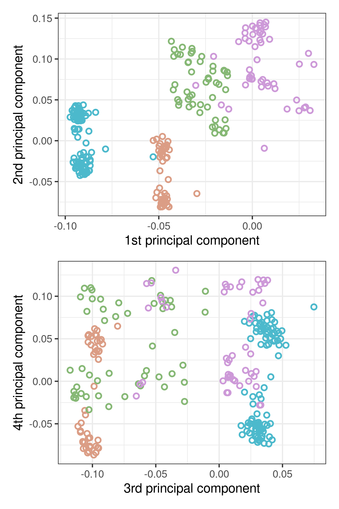 

]]]


 -->


---

background-image: url(../img-lib/algorithm-demo_2.png)
background-size: contain

### Belief-Propagation Spectral Clustering


---

class: split-two
layout: true

.column[

## Synthetic Testbed

<br> <br>
   
]

.column[.stretch[ 
  {{content}}
]]


---

class: 

## Plain Spectral

<br>
   

Adjusted Rand Index (ARI): 

- ARI = 1: perfect clustering. 
- ARI = 0: random noise.

???

Recall that we wanted to *fill in the gaps*. 

---

class: 

## BP Spectral

<br>
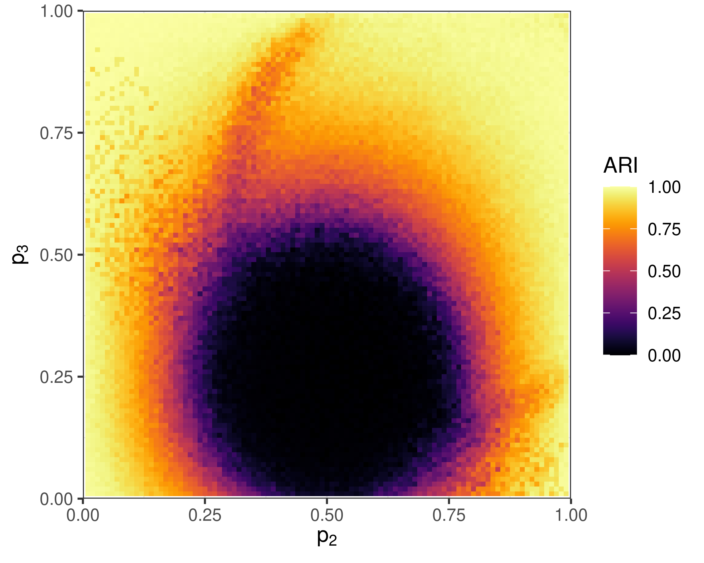

Adjusted Rand Index (ARI): 

- ARI = 1: perfect clustering. 
- ARI = 0: random noise.

???

Oops! Uh, new gaps. Time to take a detour for some more advanced machinery. 

---

class: 

## BP Spectral


<br>
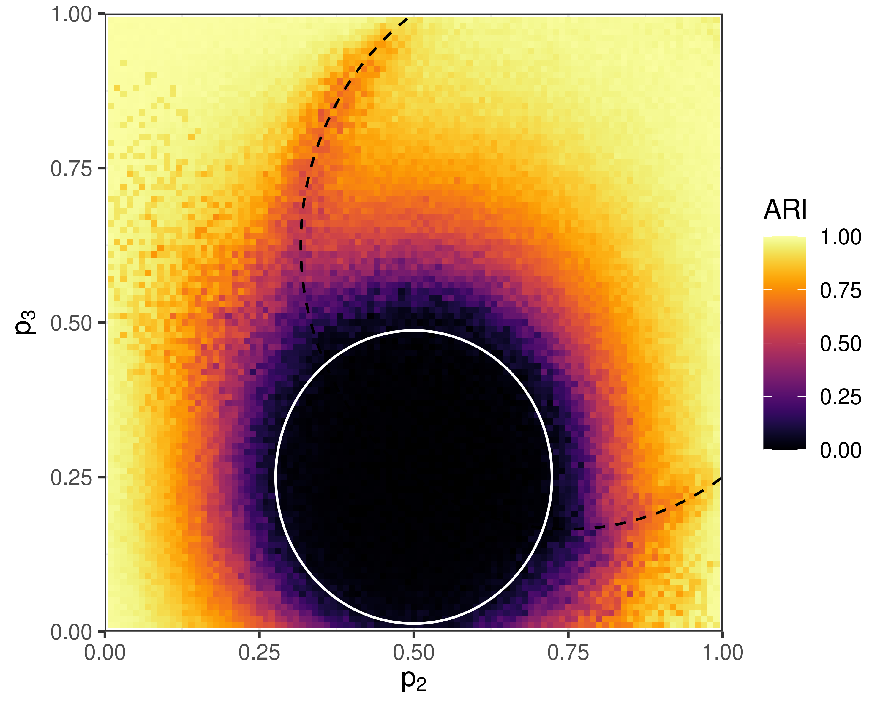

Adjusted Rand Index (ARI): 

- ARI = 1: perfect clustering. 
- ARI = 0: random noise.


---

layout: false
class: split-two

.column.bg-main1[
### Detectability (Algorithmic)

.font_smaller[
**Conjecture**: In a 2-group blockmodel with edge sizes $k_1,k_2,\ldots$ and $c_k$ edges of size $k$ per node, .alert[spectral clustering] fails to detect clusters in the ellipsoid with centroid $(x_{k_1},x_{k_2},\ldots)$ and radii $(r_{k_1},r_{k_1}\ldots)$, where: 


$$
\begin{align}
x_k &= \frac{1-f_k}{2-f_k}  \\ 
r_k &= \frac{\sqrt{(k-1)c_k}}{2-f_k} \\
f_k &= \frac{1-2^{2-k}}{1-2^{1-k}}\;.
\end{align}
$$
]

.footnote[Proof requires controlling spectrum of Hashimoto operator, possibly generalizing approach used by Bordenave et al., *Annals of Probability* 2018
]

]

.column[.stretch[
.center[ <br> <br> <br>
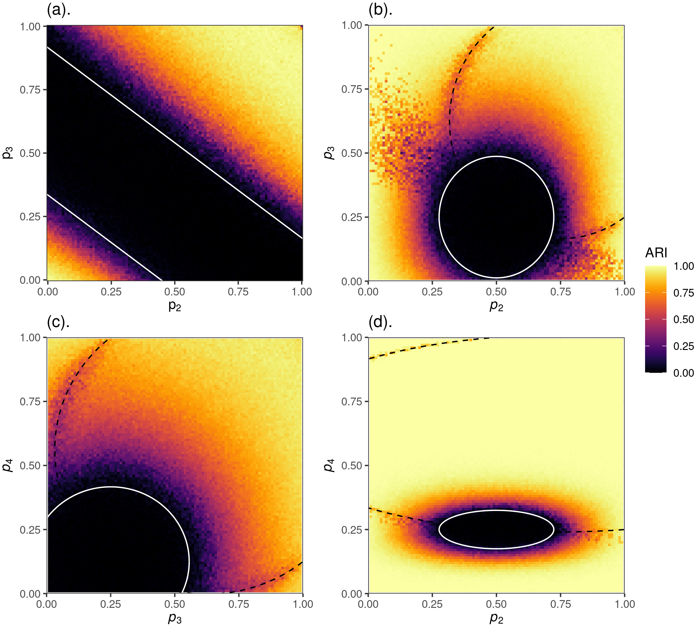
]
]
]

---

class: split-two

.column.bg-main1[
### Detectability (Fundamental)

.font_smaller[
**Conjecture**: In a 2-group blockmodel with edge sizes $k_1,k_2,\ldots$ and $c_k$ edges of size $k$ per node, .alert[any algorithm] fails to detect clusters in the ellipsoid with centroid $(x_{k_1},x_{k_2},\ldots)$ and radii $(r_{k_1},r_{k_1}\ldots)$, where: 


$$
\begin{align}
x_k &= \frac{1-f_k}{2-f_k}  \\ 
r_k &= \frac{\sqrt{(k-1)c_k}}{2-f_k} \\
f_k &= \frac{1-2^{2-k}}{1-2^{1-k}}\;.
\end{align}
$$
]

.footnote[Generalizes recent theorem for graph blockmodels by Mossel et al., *Combinatorica* 2018
]

]

.column[.stretch[
.center[ <br> <br> <br>

]
]
]

---

<!-- background-image: url(img/stack-exchange-illustration.png)
background-size: contain -->

### Example Data: Mapping Math with StackExchange Tags

<br>
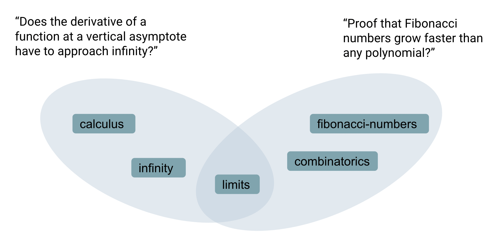   


---

layout: false 
background-image: url("img/clustering-math.png")
background-size: contain

Clustering Math StackExchange


---

class: split-two
layout: false

.column.bg-main1[

## Summing Up

<br>

Belief-propagation spectral clustering can help us form conjectures about when detecting clusters is .alert[even possible].  

Proving these conjectures is likely to require some powerful machinery from random matrix theory and discrete probability. 

The structure of the nonbacktracking operator enables us to make useful simplifications towards fast computations. 

]

.column[.stretch[
.center[ <br> <br> <br>

]
]
]


---

class: split-two

.column.bg-main1[
# **Thanks!**
.row[ 
.split-two[
.column[.lil-stretch[<br><br><br><br> 
   
  .alert[**Nicole Eikmeier**] <br> Grinnell 
  ]
  ]
.column[
  .lil-stretch[<br><br><br><br>
   
  .alert[**Jamie Haddock**] <br> Harvey Mudd 
  ]
]]]

<br><br><br><br><br><br><br><br><br>
<b>PSC</b>, N. Eikmeier, J. Haddock, (2022). Nonbacktracking spectral clustering of nonuniform hypergraphs, <i>arXiv:2204.13586</i>
]

.column[ 

<br> <br> <br> <br> <br> 

# Questions?

(maybe you want to see this algorithm on [more real data](#data-slide)...?)

]

---

class: middle bg-main4  

# Extra slides


---

name: data-slide

## High School Social Contacts 

<br> 

  $n = 327$ students (nodes) in a French high school. 

  $m = 7,818$ social contact events (edges) measured by wearable 
  sensors.   

  Average number of participants in interaction $\langle k \rangle = 2.3$ 

  Cluster labels are the classes to which students are assigned. 


  <div class="footnote">
    Data originally from: <br>
    R. Mastrandrea et al. (2015), Contact patterns in a high school: A comparison between data collected using wearable sensors, contact diaries, and friendship surveys. <i>PLoS One</i> 10:9, e0136497
    <br> <br> 
    Prepared by 
    A. R. Benson et al. (2018), Simplicial closure and higher-order link prediction. <i>Proceedings of the National Academy of Sciences</i> 10.1073/pnas.1800683115  
  </div>

---
background-image: url(../img-lib/contact-high-school-classes.png)
background-size: contain

## High School Social Contacts 

---

## On the Other Hand...Senate Bills

<br> 

  $n = 293$ U.S. senators (nodes) cosponsoring bills.

  $m = 20,006$ bills (edges) in period 1973-2016.

  Average number of cosponsors $\langle k \rangle = 7.3$.

  Cluster labels are Democrat/Republican. 


<div class="footnote">
  Data originally from: <br>
  J. Fowler (2006), Legislative cosponsorship networks in the U.S. House and Senate. <i>Social Networks</i> 28:4, 454--465
  <br> <br> 
  Prepared by 
  A. R. Benson et al. (2018), Simplicial closure and higher-order link prediction. <i>Proceedings of the National Academy of Sciences</i> 10.1073/pnas.1800683115  
</div>


---
background-image: url(../img-lib/SN-congress-bills.png)
background-size: contain

## Senate Bills

---
class: bg-main2

<br> <br> <br> <br>  
### .alert[Big Picture]: you want hypergraph methods when edges of different sizes give you different information about the cluster structure. 
