## {.split-50 background-image="fig/midd-campus.jpg" background-size="cover" background-position="center" background-repeat="no-repeat"} 
     
#### Hi everyone! 

I'm **Phil Chodrow**. I'm a new-ish assistant professor of computer science at Middlebury College, your neighbor ~1 hour south.  I did my PhD in operations research at MIT and a postdoc with Mason Porter in math at UCLA. 

::: {.column}

     

##### I like to work on...

- Higher-order networks, hypergraphs
- Math models of social systems: opinion dynamics, hierarchy formation, segregation
- Data science for social justice

##### I teach...

- Machine learning
- Network science
- Discrete math

::: 

::: {.column}

     

##### I also like...

- Aikido
- Hiking, cycling
- Tea
- Chess
- Books (scifi, fantasy, history)

::: {.fragment .absolute right=50 top=320}

<iframe src="https://www.facebook.com/plugins/video.php?height=314&href=https%3A%2F%2Fwww.facebook.com%2Faikidoofchamplainvalley%2Fvideos%2F648819024947801%2F&show_text=false&width=560&t=0" width="560" height="314" style="border:none;overflow:hidden" scrolling="no" frameborder="0" allowfullscreen="true" allow="autoplay; clipboard-write; encrypted-media; picture-in-picture; web-share" allowFullScreen="true"></iframe>

:::

:::

## 

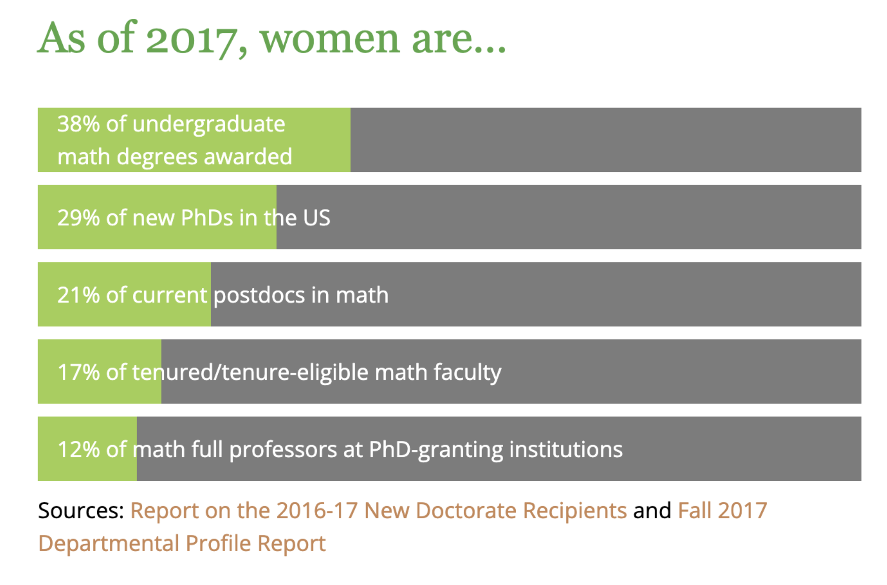{fig-align="center"}

[]{.footnote}

## 

#### Questions for today

    

::: {.textblock .fragment}

What [**mechanisms**]{.alert} drive (lack of) gender representation in academic mathematics? 

:::

::: {.textblock .fragment}

[**What can we expect**]{.alert} to happen  if these mechanisms continue to operate as is? 

:::

::: {.textblock .fragment}

What could the effects of [**interventions**]{.alert} be on long-term gender representation?

:::

## 

#### The Team

<table style="padding:0px;border-bottom:0pxmargin: 0px auto; ">
<tr style="border:0px;padding:0px;margin:0px;">
<td style="padding:0px;border-bottom:0px"> 
{.portrait-small} 
</td>
<td style="vertical-align: middle;white-space:nowrap;padding:0px;border-bottom:0px">

**Heather Brooks**   Harvey Mudd

</td>

<td style="vertical-align: middle;padding:0px;border-bottom:0px"> 
{.portrait-small} 
</td>
<td style="vertical-align: middle;white-space:nowrap;padding:0px;border-bottom:0px">

**Harlin Lee**   UNC Chapel Hill

</td>

</tr>

<tr>

<td style="vertical-align: middle;padding:0px;border-bottom:0px"> 
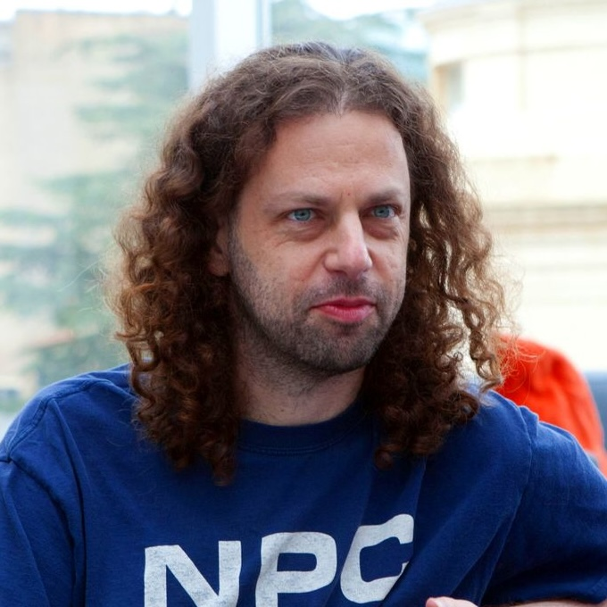{.portrait-small} 
</td>
<td style="vertical-align: middle;white-space:nowrap;padding:0px;border-bottom:0px">

**Mason Porter**   UCLA

</td>

<td style="vertical-align: middle;padding:0px;border-bottom:0px"> 
{.portrait-small} 
</td>
<td style="vertical-align: middle;white-space:nowrap;padding:0px;border-bottom:0px">

**Juan G. Restrepo**   CU Boulder

</td>

</tr>

<tr>
<td style="vertical-align: middle;padding:0px;border-bottom:0px"> 
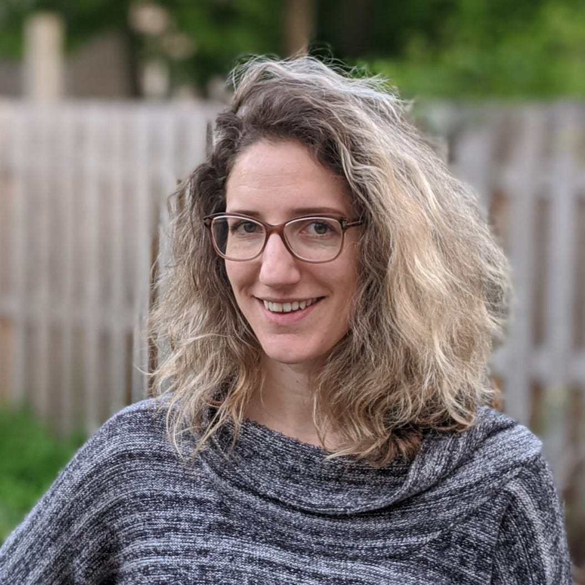{.portrait-small} 
</td>
<td style="vertical-align: middle;white-space:nowrap;padding:0px;border-bottom:0px">

**Anna Haensch**   Tufts

</td>

<td style="vertical-align: middle;padding:0px;border-bottom:0px"> 
{.portrait-small} 
</td>
<td style="vertical-align: middle;white-space:nowrap;padding:0px;border-bottom:0px">

**Phil Chodrow**   Middlebury

</td>

</tr>

</table>

## 

##### Inspiration from... 

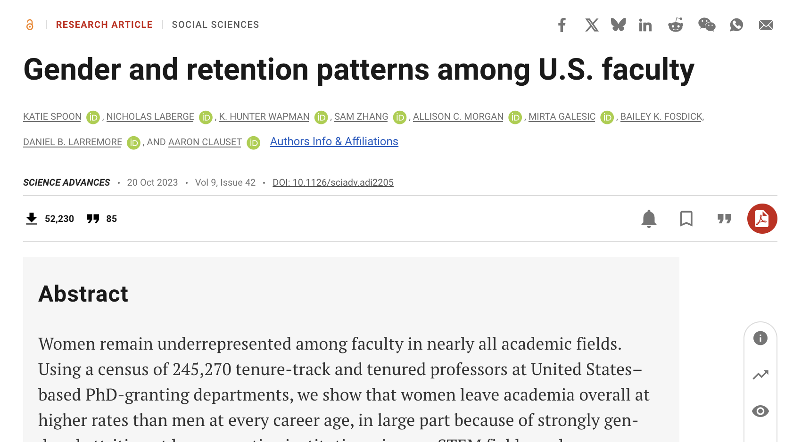{.absolute left=50 top=100 width=40% align=left}

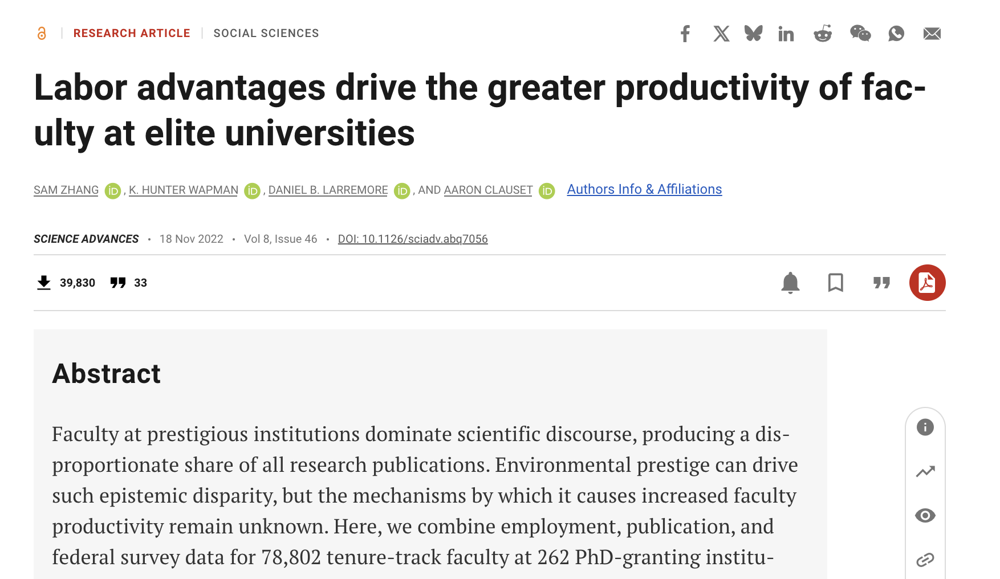{.absolute right=50 top=100 width=40% align=right}

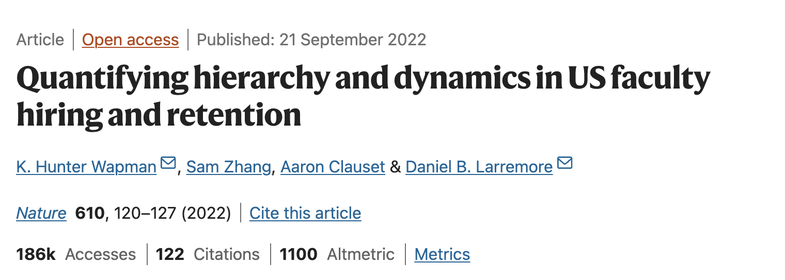{.absolute width=40% top=400 right=50}

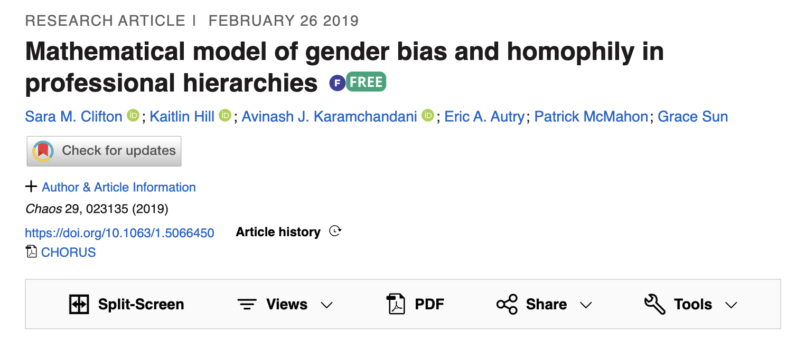{.absolute width=50% top=400 left=50}

## 

### Some early caveats

 

:::{.textblock .fragment .semi-fade-out fragment-index=1}
This talk represents **work-in-progress** using data about our mathematics community. [**All results are preliminary!**]{.alert}
:::

:::{.textblock .fragment .fade-in-then-semi-out fragment-index=1}
This talk focuses on the [**production of PhD graduates**]{.alert} and therefore almost exclusively considers doctoral universities.
:::

:::{.textblock .fragment .fade-in-then-semi-out fragment-index=2}
[**Gender is not binary**]{.alert}, but unfortunately our data (and therefore our story and our model) are.
:::

:::{.textblock .fragment .fade-in}

[**Quantitative work complements, but never replaces**]{.alert}: voices of marginalized scholars, qualitative research and critical theory, activism, and implementation of initiatives and policies. 

:::

## {.split-50}

::: {.column}

### Our data

 

:::

::: {.column}

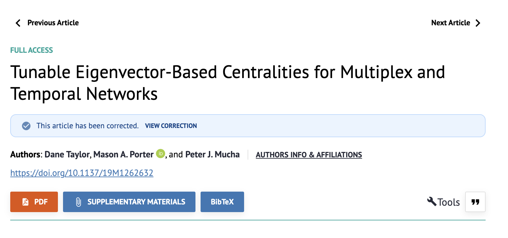{width=80%}

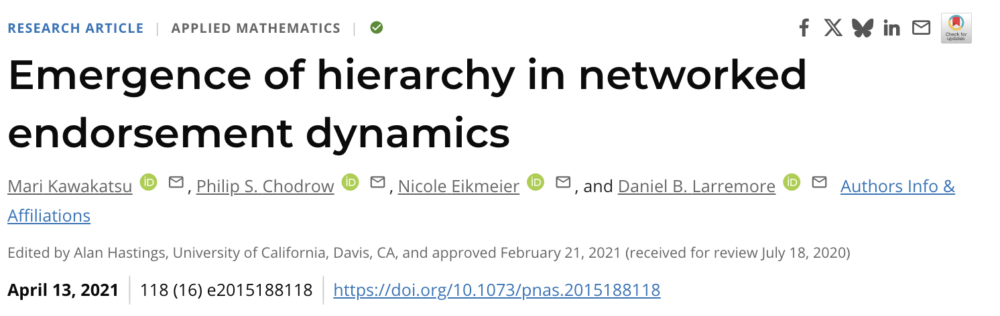{width=80%}

{width=80%}

:::

## {.split-50}

::: {.column}

### Our data

 

:::

::: {.column}

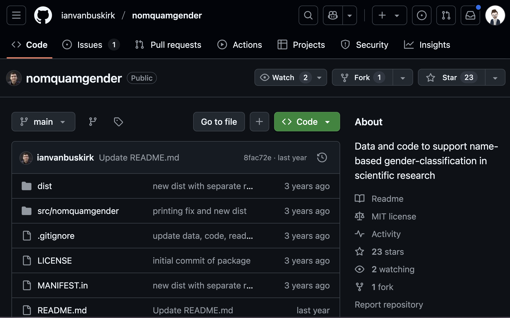{.absolute left=50 top=20 width=80%}
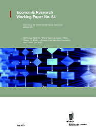{.absolute left=250 top=20}

{.absolute width=40% top=300}

[Ben Brill, UCLA '22]{.absolute width=30% top=350 left=300}

[Total of 116,306 advisor-student pairs in the US since 1950, representing 21,781 distinct advisors. 
We observe or estimate math subfields for 94% of these pairs (predictions based on thesis titles). 
We estimate gender for 95% of PhD students and 97% of advisors. ]{.footnote}

:::

## 

### Data issues..

{fig-align="center"}

:::{.textblock-vertical .absolute left=300 top=150 .fragment}

Misgendering

Incorrect MSCs inferred 

Nonrandom missing data

Various shenanigans

:::

## 

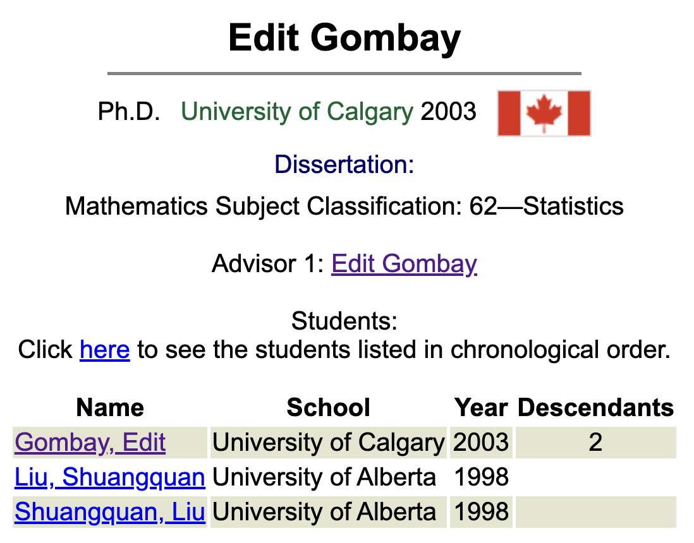{fig-align="center"}

## {background-image="fig/basic-counts-and-trajectories.png" background-size="contain" background-position="center" }

## 

### Some hypotheses

    

<table>

<tr>
<td style="padding:0.5rem;border-bottom:0px">

:::{.textblock-vertical .fragment .semi-fade-out fragment-index=1}

[**Mentorship**]{.alert}

*Female advisors are more effective in attracting or retaining female graduate students.*
:::

</td>
<td style="padding:0.5rem;border-bottom:0px">

:::{.textblock-vertical .fragment .fade-in-then-semi-out fragment-index=1}

[**Belonging**]{.alert }

*Greater representation in the grad student community attracts women to programs and subfields.*

:::

</td>
<td style="padding:0.5rem;border-bottom:0px">

:::{.textblock-vertical .fragment .fade-in-then-semi-out fragment-index=2}
[**Attrition**]{.alert}

*Addressing disparities in career attrition for female faculty would help to close the gender gap.* 

:::
</td>
<td style="padding:0.5rem;border-bottom:0px">

:::{.textblock-vertical .fragment .fade-in fragment-index=3}
[**Leadership**]{.alert}

*A small number of influential women can dramatically change the culture of a department or research community.*

:::
</td>
</tr>

</table>

## {background-image="fig/phase-portrait-binned.png" background-size="contain" background-position="center" }

[Many math subfields are on   qualitatively similar trajectories.]{.absolute right=75 top=100}

[*Six largest subfields by record count.*]{.absolute right=150 bottom=100}

## 

### Two-prong modeling strategy 

 

::: {.textblock}

[**Advisor production**]{.alert} 

Model the *number of graduate students produced* by a given advisor. 

*Technique: maximum likelihood estimation in a bespoke stochastic model.* 

:::

  

::: {.textblock}

[**Student gender**]{.alert} 

Model the gender of students produced by a given advisor.  

*Technique: logistic regression.* 

:::

##

### Generative model of advisor production

{fig-align="center"}

**Assumptions**: 

- Startup depends on subfield. 
- Career length depends on gender. 
- \# students per year depends on subfield and gender.

##

#### Latent variable model

We model an observed sequence of students $\color{#086788}{\mathbf{S}} = (\color{#086788}{S}_1, \color{#086788}{S}_2, \ldots, \color{#086788}{S}_T)$ produced by an advisor as a function of an *unobserved* advisor career $\color{#07A0C3}{C}$ specified by the startup period length and retirement year. 

::: {.big-equation}

$$
\begin{aligned}
  p(\color{#086788}{\mathbf{S}};\color{#F25C54}{\boldsymbol{\theta}}) &= \sum_{\color{#07A0C3}{C}\in\mathcal{C}} p(\color{#086788}{\mathbf{S}}|\color{#07A0C3}{C};\color{#F25C54}{\boldsymbol{\theta}})p(\color{#07A0C3}{C};\color{#F25C54}{\boldsymbol{\theta}}) 
\end{aligned}
$$

:::

The vector $\color{#F25C54}{\boldsymbol{\theta}}$ contains the parameters to be estimated. 

We do this using a hybrid expectation-maximization algorithm: some parameters can be estimated efficiently via EM, while others must be estimated by hill-climbing. 

##

#### Men have estimated careers ~4 years longer

{fig-align="center"}

## 

##### Longer careers $\times$ more students per year = more students per career

{fig-align="center"}

:::{.textblock .fragment}

We hypothesize that greater student production per year reflects unequal access to research resources; cf. Zhang et al. (2022)

:::

##

### Logistic model for advisee gender

Estimate the odds that the next student produced by an advsior is female based on subfield, advisor gender, and representation of women in advisor group and subfield.

::: {.bigger-equation}
$$
\begin{aligned}
  \log (\text{odds F}) = & \beta_0 + \\ 
                         & \rho \times (\text{advisor is F}) + \\
                         & \gamma_1 \times (\text{proportion F advisees in group}) + \\ 
                         & \gamma_2   \times (\text{proportion F advisees in group})^2 +\\
                         & \eta_{1} \times (\text{proportion F in subfield}) + \\ 
                         & \eta_{2} \times (\text{proportion F in subfield})^2 
\end{aligned}
$$  

:::

*We tried a lot of other models with other features (e.g. decade, nonlinear transformations, etc) but this one was best in cross-validation among those without an explicit term for the topic of the subfield*. 

##

### Logistic model for advisee gender

Estimate the odds that the next student produced by an advisor is female based on subfield, advisor gender, and representation of women in advisor group and subfield.

$$
\begin{aligned}
  \log (\text{odds F}) = & \beta_0 + &\quad \beta_0 &= -3.30 \; (0.05)\\ 
                         & \rho \times (\text{advisor is F}) + &\quad\rho &= \phantom{-}0.42 \;(0.02)\\
                         & \gamma_1 \times (\text{proportion F advisees in group}) + &\quad \gamma_1 &= \phantom{-}1.49\; (0.16)\\ 
                         & \gamma_2   \times (\text{proportion F advisees in group})^2 + &\quad \gamma_2 &= -0.51 \;(0.24)\\
                         & \eta_{1} \times (\text{proportion F in subfield}) + &\quad \eta_1 &= \phantom{-}4.16 \; (0.33)\\ 
                         & \eta_{2} \times (\text{proportion F in subfield})^2 &\quad \eta_2 &= \phantom{-}1.53 \; (0.51)
\end{aligned}
$$  

## {.split-40}

::: {.column}

##### Homophily effects: advisor-student and student-student

Both the gender of a students' specific advisor *and* the overall proportion of female advisors in the subfield's population contribute to the likelihood that the student is female. 

*High uncertainty in the model predictions for large $p_F$ reflects the fact that we have very little data in that region.* 

:::

::: {.column}

   

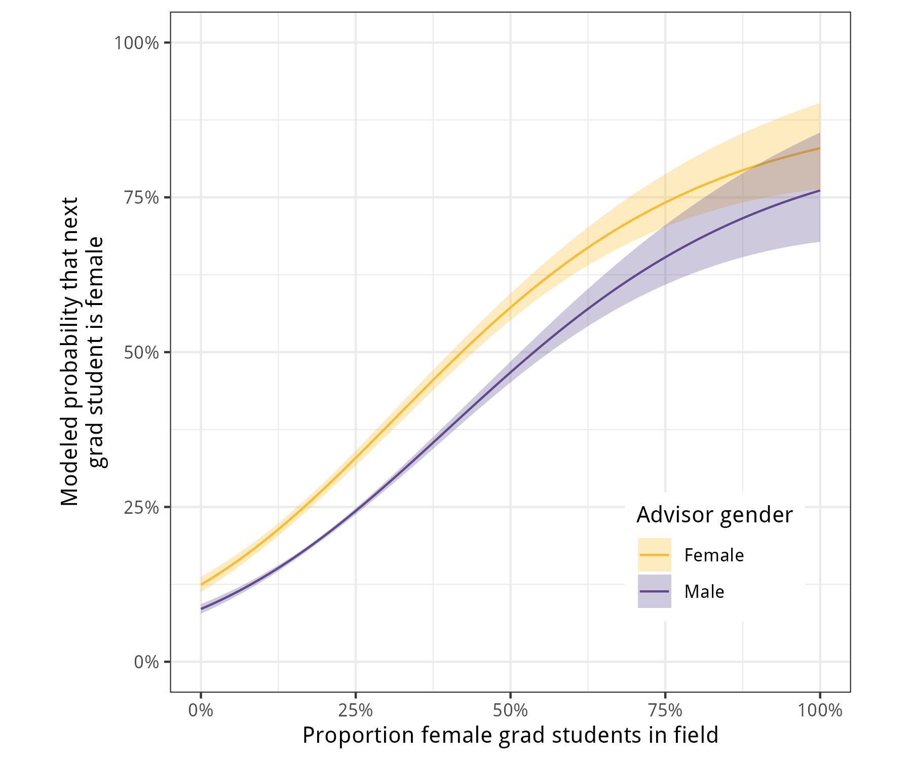{.absolute top=100 right=50 width=140%}

:::

## {.split-40}

::: {.column}

##### Numerical estimation of stationary proportion

If $p^*$ is the stationary proportion of graduates in the subfield, then $p^*$ approximately satisfies
$$
\begin{aligned}
  p^* = \color{#ffaf03}{w_f}\color{#ffaf03}{\sigma_f}(p^*) + \color{#5b427c}{w_m} \color{#5b427c}{\sigma_m}(p^*)  
\end{aligned}
$$

- $\sigma_g(p^*)$: prob. next student of an advisor of gender $g$ is female. 
- $w_g$: proportion of students in subfield advised by advisors of gender $g$ (estimated from advisor production model).

[Mean-field assumption: advisor groups represent the subfield as a whole.]{.footnote} 

:::

::: {.column}

  

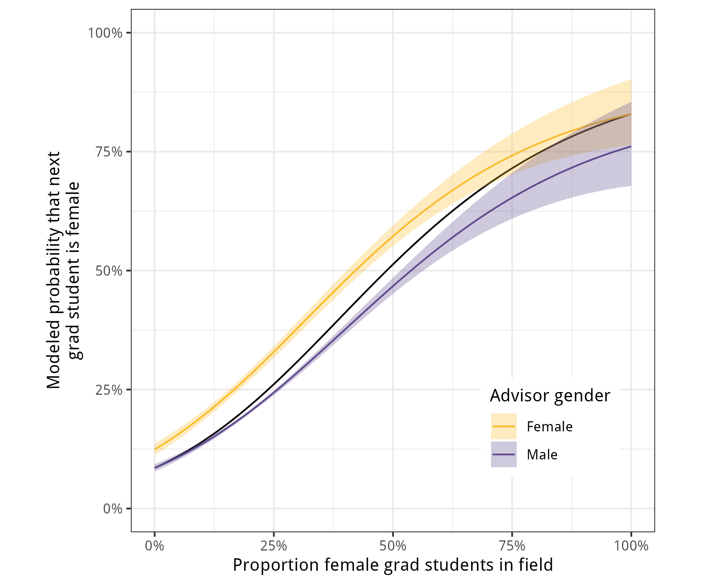{.absolute top=100 right=50 width=140%}

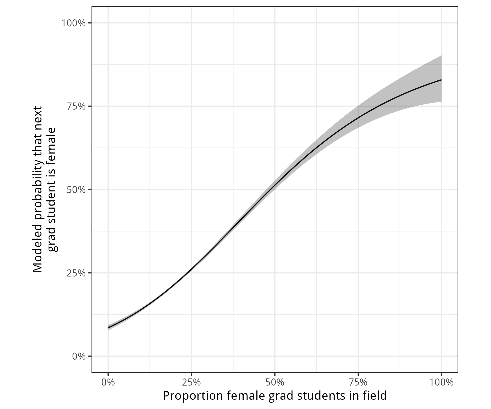{.absolute top=100 right=50 width=140% .fragment}

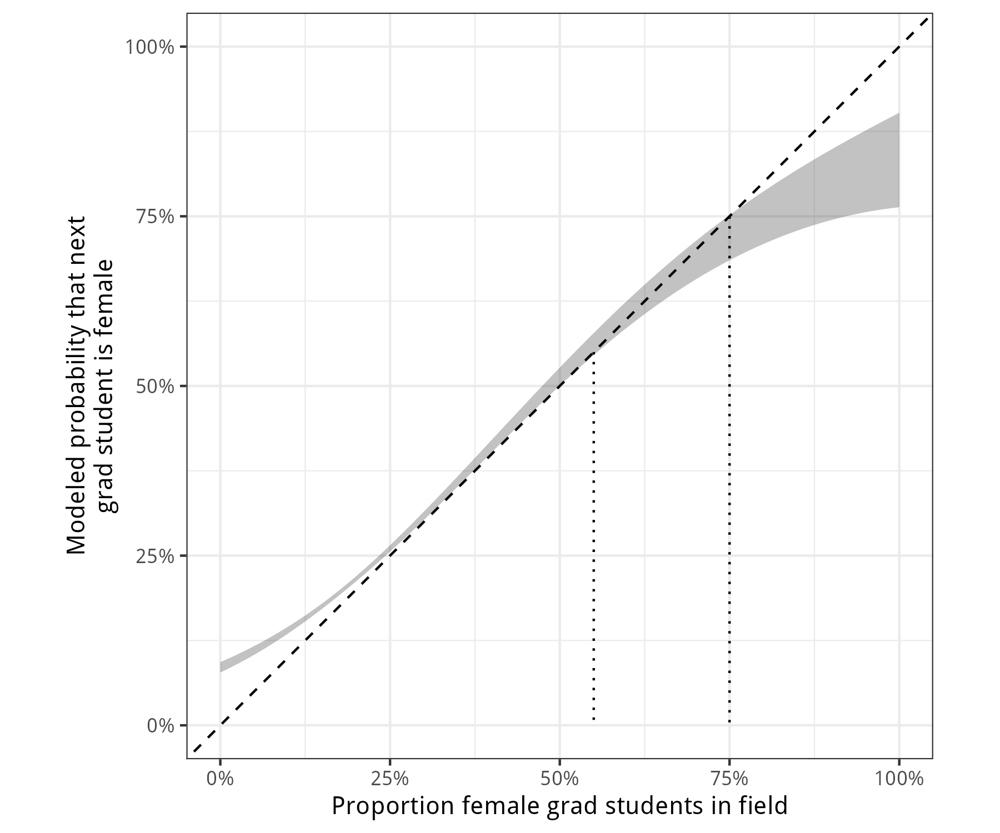{.absolute top=100 right=50 width=140% .fragment}

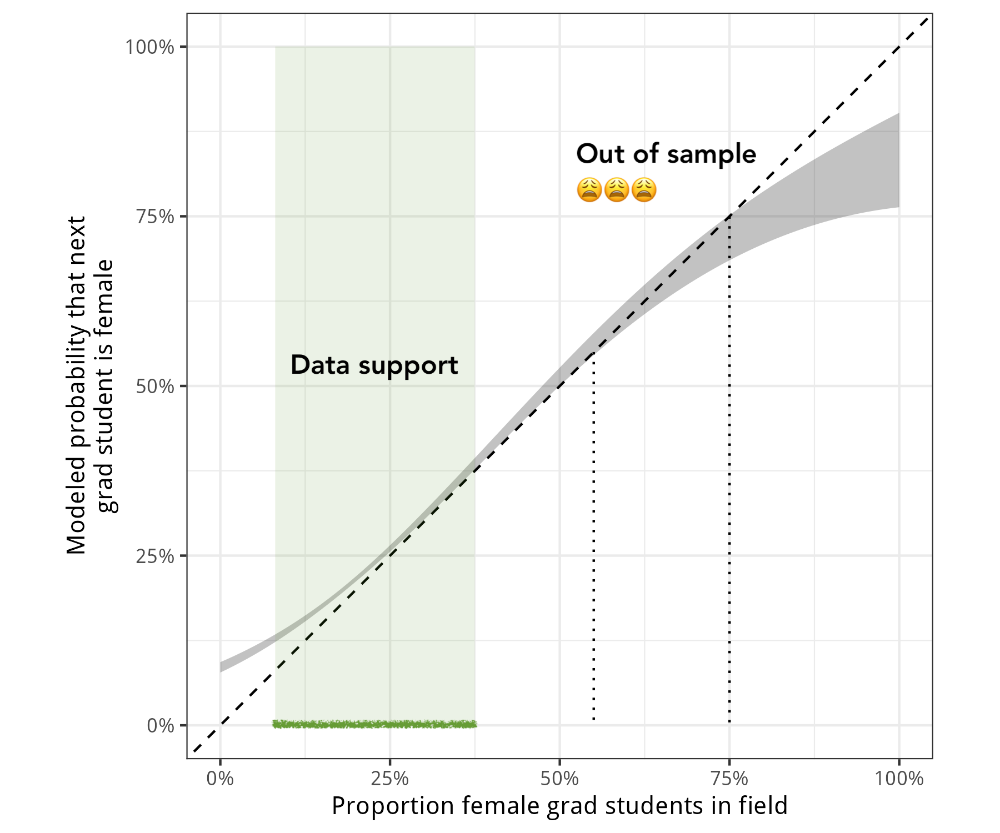{.absolute top=100 right=50 width=140% .fragment}

:::

## {.split-30}

##### What might we expect near-term?

::: {.column}

              
*10 simulations initialized with 1,000 active advisors, 20% female.*

:::

::: {.column}

  

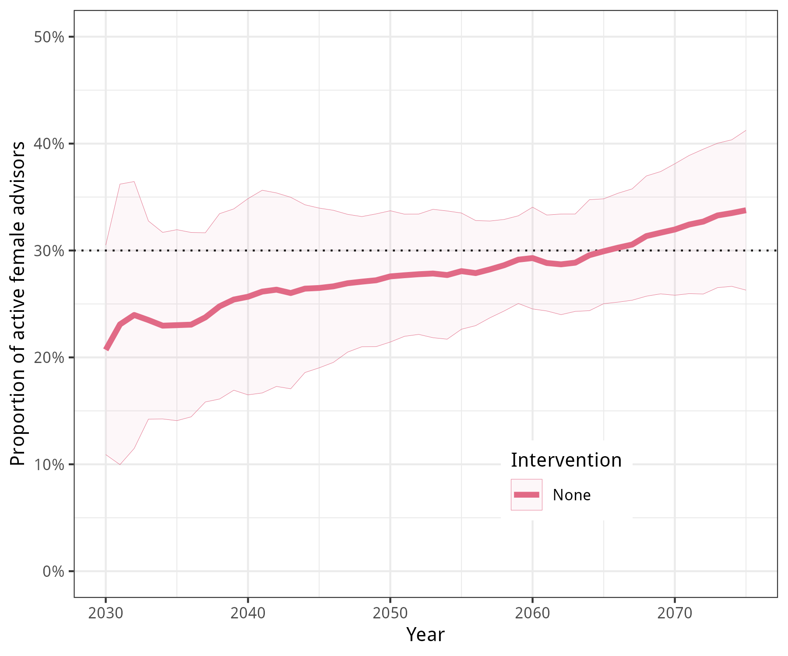{.absolute top=100 right=50 width=90% .fragment}

                              

:::

## {.split-50}

#### What could we do to make math a more inclusive profession? 

::: {.column}

        

::: {.textblock .fragment}

**[Attrition Hypothesis]{.alert}**

*Addressing disparities in career attrition for female faculty would help to close the gender gap.*

:::

::: {.textblock .fragment}

**[Approach]{.alert}**

We can model equalizing career lengths and student production per year.  

:::

:::

::: {.column}

{.absolute top=175 right=50 width=90% .fragment}

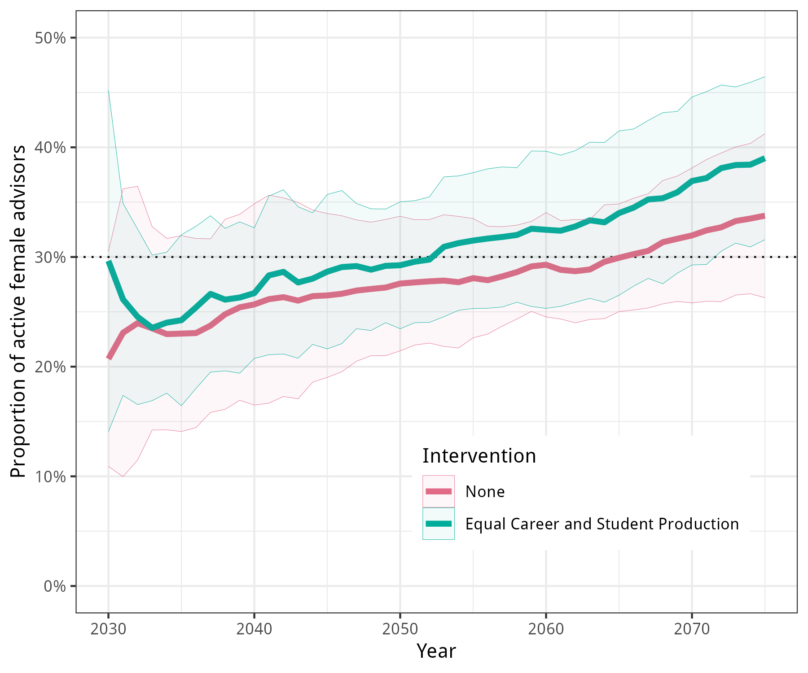{.absolute top=175 right=50 width=90% .fragment}

:::

## 

### Some hypotheses

<table>

<tr>
<td style="padding:0.5rem;border-bottom:0px">

:::{.textblock-vertical .fragment .semi-fade-out fragment-index=3}

[**Mentorship**]{.alert}

*Female advisors are more effective in attracting or retaining female graduate students.*

:::

</td>
<td style="padding:0.5rem;border-bottom:0px">

::: {.fragment .semi-fade-out fragment-index=5}

:::{.textblock-vertical .fragment .fade-in fragment-index=3}

[**Belonging**]{.alert }

*Greater representation in the grad student community attracts women to programs and subfields.*

:::
:::

</td>
<td style="padding:0.5rem;border-bottom:0px">

::: {.fragment .semi-fade-out fragment-index=7}

:::{.textblock-vertical .fragment .fade-in fragment-index=6}
[**Attrition**]{.alert}

*Addressing disparities in career attrition for female faculty would help to close the gender gap.* 

:::

:::
</td>
<td style="padding:0.5rem;border-bottom:0px">

:::{.textblock-vertical .fragment .fade-in fragment-index=10}
[**Leadership**]{.alert}

*A small number of influential women can dramatically change the culture of a department or research community.*

:::
</td>
</tr>

<tr>

<td style="padding:0.5rem;border-bottom:0px">
::: {.textblock-vertical-inverse .fragment .fade-in-then-semi-out fragment-index=2}

[**Yes!**]{.alert}

Female advisors are substantially more likely than male advisors to produce female PhD graduates. 

:::
</td>

<td style="padding:0.5rem;border-bottom:0px">
::: {.textblock-vertical-inverse .fragment .fade-in-then-semi-out fragment-index=4}

[**Yes!**]{.alert}

Subfields/advisor groups with greater representation of women tend to attract more women. 

:::
</td>

<td style="padding:0.5rem;border-bottom:0px">
::: {.textblock-vertical-inverse .fragment .fade-in-then-semi-out fragment-index=7}

[**Yes!**]{.alert}

This is an intrinsically inclusive, equitable goal AND may also accelerate progress by 10-20 years.  

:::
</td>

<td style="padding:0.5rem;border-bottom:0px">
::: {.textblock-vertical-inverse .fragment .fade-in fragment-index=11}

[**We're exploring...**]{.alert}

We're developing models and data analysis to try to detect these effects in our data set. 

:::
</td>

</tr>

</table>

{.absolute .fragment fragment-index=5 top=430  width=20% left=180 }

{.absolute .fragment fragment-index=8 top=430  width=20% left=532}

## {background-image="fig/tree.png" background-size="contain" background-position="center" background-repeat="no-repeat"}

### Next?

## 

#### Thanks everyone!

  

<table style="padding:0px;border-bottom:0pxmargin: 0px auto; ">
<tr style="border:0px;padding:0px;margin:0px;">
<td style="padding:0px;border-bottom:0px"> 
{.portrait-smaller} 
</td>
<td style="vertical-align: middle;white-space:nowrap;padding:0px;border-bottom:0px">

**Heather Brooks**   Harvey Mudd

</td>

<td style="vertical-align: middle;padding:0px;border-bottom:0px"> 
{.portrait-smaller} 
</td>
<td style="vertical-align: middle;white-space:nowrap;padding:0px;border-bottom:0px">

**Harlin Lee**   UNC Chapel Hill

</td>

<td style="vertical-align: middle;padding:0px;border-bottom:0px"> 
{.portrait-smaller} 
</td>
<td style="vertical-align: middle;white-space:nowrap;padding:0px;border-bottom:0px">

**Mason Porter**   UCLA

</td>
</tr>

<tr>

<td style="vertical-align: middle;padding:0px;border-bottom:0px"> 
{.portrait-smaller} 
</td>
<td style="vertical-align: middle;white-space:nowrap;padding:0px;border-bottom:0px">

**Juan G. Restrepo**   CU Boulder

</td>

<td style="vertical-align: middle;padding:0px;border-bottom:0px"> 
{.portrait-smaller} 
</td>
<td style="vertical-align: middle;white-space:nowrap;padding:0px;border-bottom:0px">

**Anna Haensch**   Tufts

</td>

<td style="vertical-align: middle;padding:0px;border-bottom:0px"> 
{.portrait-smaller} 
</td>
<td style="vertical-align: middle;white-space:nowrap;padding:0px;border-bottom:0px">

***Ben Brill***   *UCLA '22*

</td>

</tr>

</table>

<table>
<tr>
<td style="padding:0px;border-bottom:0px">
{.portrait-small}
</td>
<td style="vertical-align: middle;white-space:nowrap;padding:0px;border-bottom:0px">

 National Science Foundation 

</td>
<td style="padding:0px;border-bottom:0px">
{.portrait-small}
</td>
<td style="vertical-align: middle;white-space:nowrap;padding:0px;border-bottom:0px">

 ICERM \@Brown   Two summer programs!

</td>
</tr>
</table>

*Preprint coming soon* 😬😬😬
