## {.split-50 background-image="fig/midd-banner-light.jpg" background-size="cover" background-position="center" background-repeat="no-repeat"} 

#### Hi everyone! I'm Phil Chodrow

::: {.column}

    

::: {.textblock .fragment}

New-ish professor of CS at Middlebury College, a small liberal arts college in Vermont.  

:::

::: {.textblock-inverse .fragment}

*Students/postdocs: ask me about [**\#LiberalArtsLife**]{.alert} if you're curious.*

:::

::: {.textblock .fragment}

PhD: Operations Research at MIT

Postdoc: Math at UCLA (with Mason Porter)

:::

:::

::: {.column}

    

::: {.textblock-inverse .fragment}

#### *I work on...*

- Higher-order networks, hypergraphs
- Math models of social systems
- Misc. data science

#### *I teach...*

- Machine learning
- Network science
- Discrete math

:::

::: 

                                

::: {.fragment}

*Also: aikido, hiking, cycling, tea, chess, gardening, books (scifi, fantasy, history)*

:::

## {.split-50 background-image="fig/midd-banner.jpg" background-size="cover" background-position="center" background-repeat="no-repeat"} 

### *Yes, it really does look like this* 😁😁😁

## 

#### Gender Representation in Academic Math

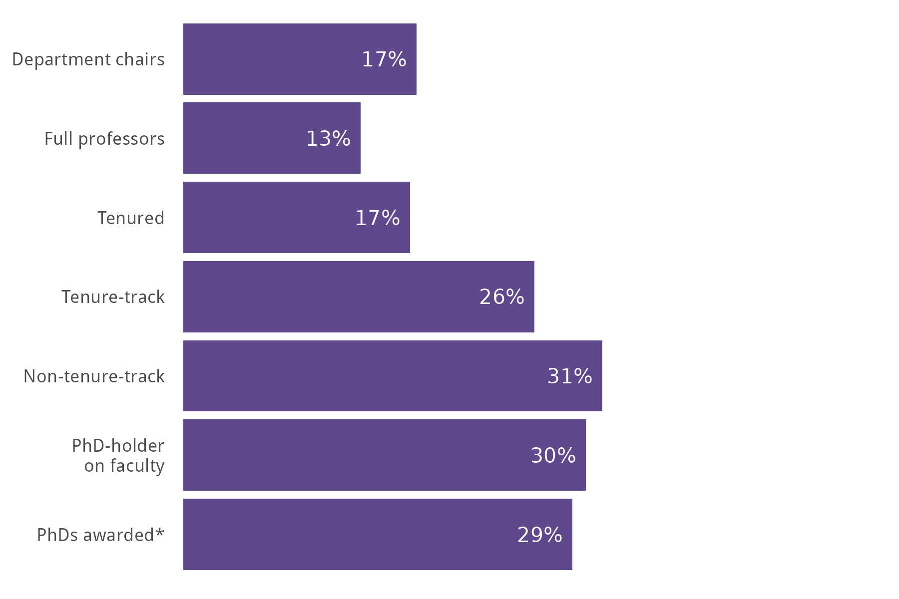{.absolute left=0 top=100 width=80% align=left}

::: {.absolute right=50 top=90 width=40% align=right}

Data from the [**2020**]{.alert-3} AMS Departmental Profile 🤦🏻‍♂️

                        

[*\*Actually this one is from 2017-2018 (Report on New Doctorates)* 🤦🏻‍♂️🤦🏻‍♂️🤦🏻‍♂️]{.fragment}

:::

## 

#### Much Work (Including From Here!)

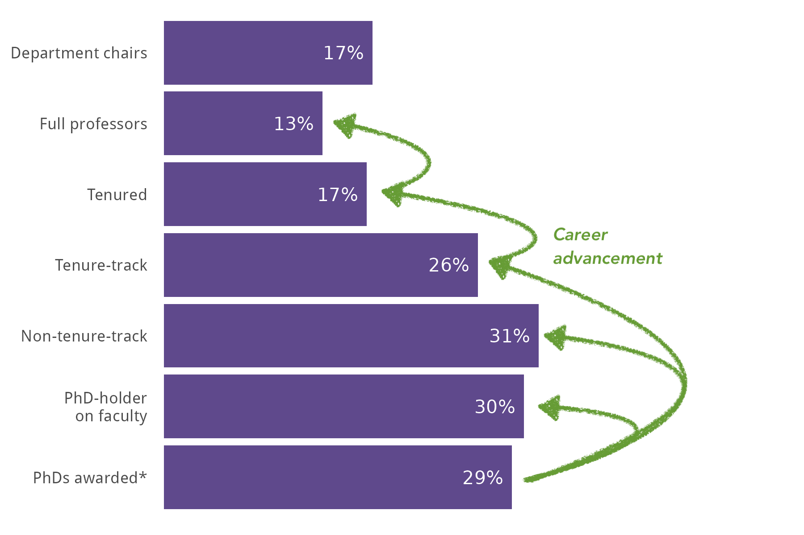{.absolute left=0 top=100 width=80% align=left}

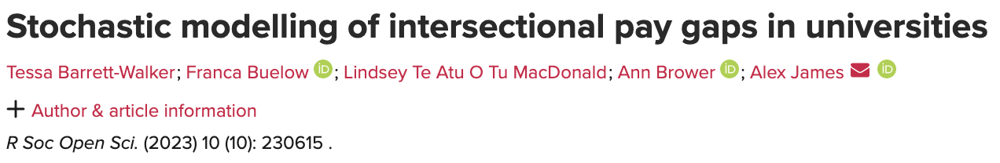{.absolute right=0 top=100 width=30% align=right}

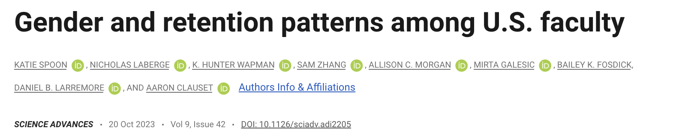{.absolute right=0 top=200 width=30% align=right}

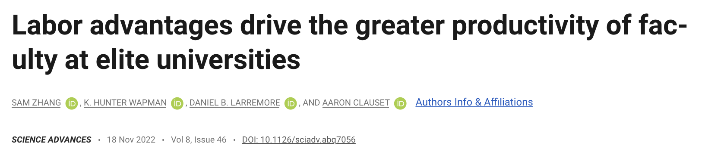{.absolute right=0 top=300 width=30% align=right}

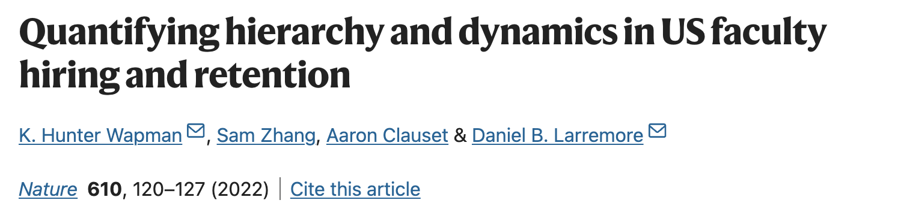{.absolute width=30% top=400 right=0}

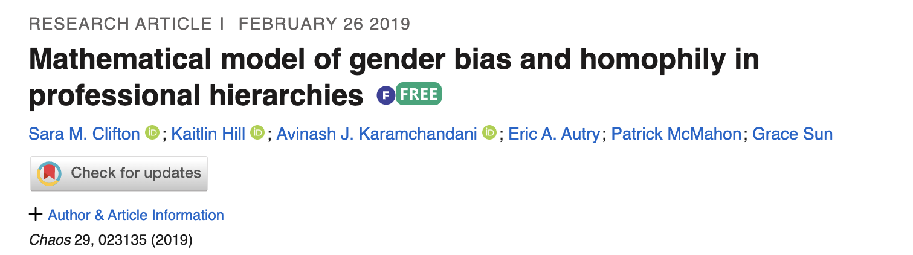{.absolute width=30% top=500 right=0}

## 

#### Focus For Today

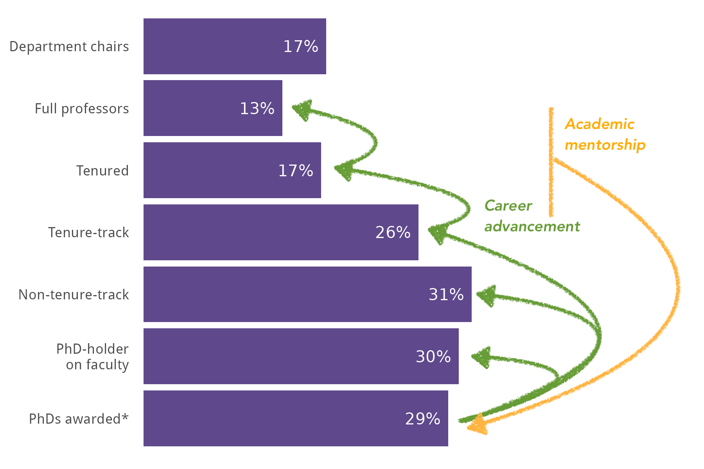{.absolute left=0 top=100 width=80% align=left}

## 

#### Questions for today

    

::: {.textblock .fragment}

What [**mechanisms**]{.alert} drive (lack of) gender representation in academic mathematics? 

:::

  

::: {.textblock-inverse .fragment}

What could the effects of [**interventions**]{.alert} be on gender representation in math?

:::

## 

#### The Team

<table style="padding:0px;border-bottom:0pxmargin: 0px auto; ">
<tr style="border:0px;padding:0px;margin:0px;">
<td style="padding:0px;border-bottom:0px"> 
{.portrait-small} 
</td>
<td style="vertical-align: middle;white-space:nowrap;padding:0px;border-bottom:0px">

**Heather Brooks**   Harvey Mudd

</td>

<td style="vertical-align: middle;padding:0px;border-bottom:0px"> 
{.portrait-small} 
</td>
<td style="vertical-align: middle;white-space:nowrap;padding:0px;border-bottom:0px">

**Harlin Lee**   UNC Chapel Hill

</td>

</tr>

<tr>

<td style="vertical-align: middle;padding:0px;border-bottom:0px"> 
{.portrait-small} 
</td>
<td style="vertical-align: middle;white-space:nowrap;padding:0px;border-bottom:0px">

**Mason Porter**   UCLA

</td>

<td style="vertical-align: middle;padding:0px;border-bottom:0px"> 
{.portrait-small} 
</td>
<td style="vertical-align: middle;white-space:nowrap;padding:0px;border-bottom:0px">

**Juan G. Restrepo**   CU Boulder

</td>

</tr>

<tr>
<td style="vertical-align: middle;padding:0px;border-bottom:0px"> 
{.portrait-small} 
</td>
<td style="vertical-align: middle;white-space:nowrap;padding:0px;border-bottom:0px">

**Anna Haensch**   Tufts

</td>

<td style="vertical-align: middle;padding:0px;border-bottom:0px"> 
{.portrait-small} 
</td>
<td style="vertical-align: middle;white-space:nowrap;padding:0px;border-bottom:0px">

**Phil Chodrow**   Middlebury

</td>

</tr>

</table>

<!-- ## 

### Some early caveats

 

:::{.textblock .fragment .semi-fade-out fragment-index=1}
This talk represents **work-in-progress** using data about our mathematics community. [**All results are preliminary!**]{.alert}
:::

:::{.textblock .fragment .fade-in-then-semi-out fragment-index=1}
This talk focuses on the [**production of PhD graduates**]{.alert} and therefore almost exclusively considers doctoral universities.
:::

:::{.textblock .fragment .fade-in-then-semi-out fragment-index=2}
[**Gender is not binary**]{.alert}, but unfortunately our data (and therefore our story and our model) are.
:::

:::{.textblock .fragment .fade-in}

[**Quantitative work complements, but never replaces**]{.alert}: voices of marginalized scholars, qualitative research and critical theory, activism, and implementation of initiatives and policies. 

::: -->

## {background-image="fig/sue.jpeg" background-size="contain" background-position="center" background-color="black"}

### Our Data

## {.split-50}

### Our Data

::: {.column}

   

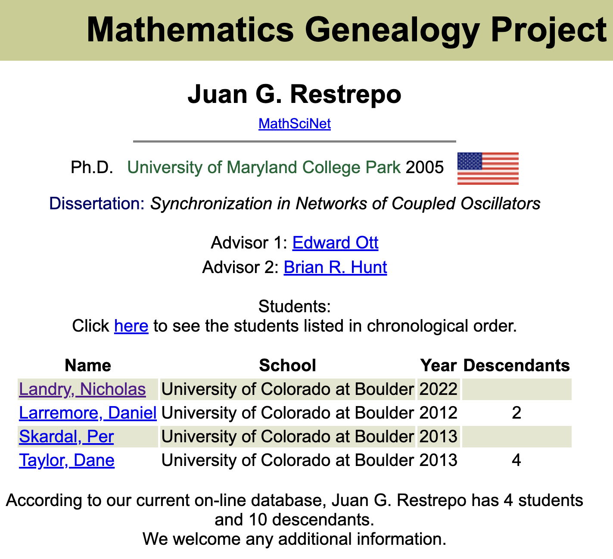

:::

::: {.column}

{width=80%}

{width=80%}

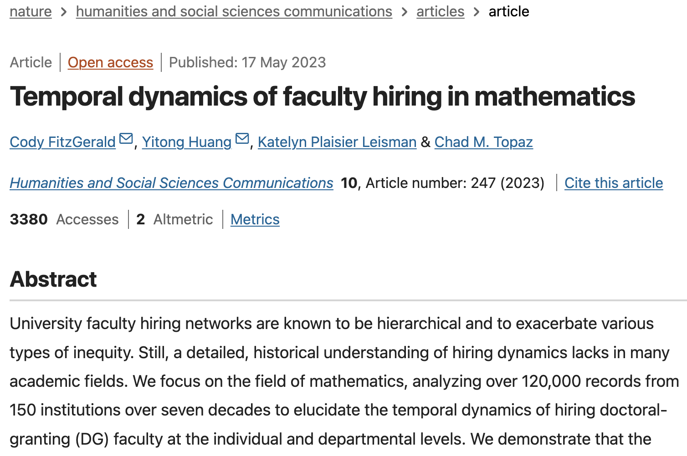{width=80%}

:::

## {.split-50}

### Our Data

::: {.column}

   

:::

::: {.column}

{.absolute left=50 top=20 width=80%}
{.absolute left=250 top=20}

{.absolute width=40% top=300}

[Ben Brill, UCLA '22]{.absolute width=30% top=350 left=300}

[Total of 116,306 advisor-student pairs in the US since 1950, representing 21,781 distinct advisors. 
We observe or estimate math subfields for 94% of these pairs (predictions based on thesis titles). 
We estimate gender for 95% of PhD students and 97% of advisors. ]{.footnote}

:::

## 

### Data issues...

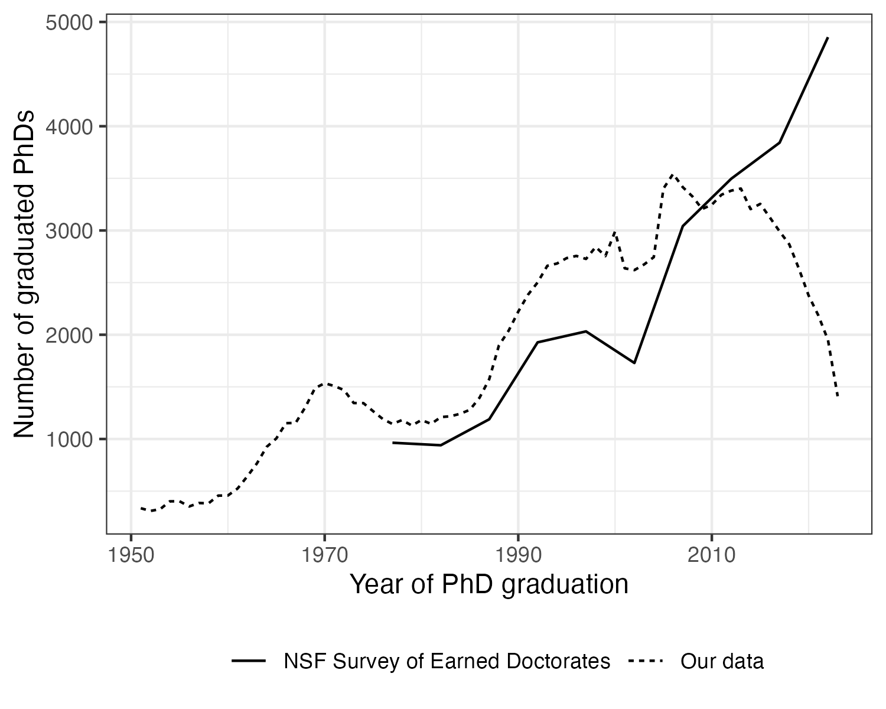{fig-align="center"}

:::{.textblock-vertical-inverse-flex .absolute left=300 top=150 .fragment}

Misgendering

Incorrect MSCs inferred 

More missing recent advisors --> undercounting female advisors

Various *shenanigans*

:::

## 

{fig-align="center"}

## {background-image="fig/tree.png" background-size="contain" background-position="center" background-repeat="no-repeat"}

## {background-image="fig/basic-counts-and-trajectories.png" background-size="contain" background-position="center" }

## 

#### Some Hypotheses

  

:::{.textblock .fragment .semi-fade-out fragment-index=1}

[**Mentorship**]{.alert}

*Female advisors are more effective in attracting or retaining female graduate students.*
:::

:::{.textblock .fragment .fade-in-then-semi-out fragment-index=1}

[**Belonging**]{.alert }

*Greater representation in the grad student community attracts women to programs and subfields.*

:::

:::{.textblock .fragment .fade-in-then-semi-out fragment-index=2}
[**Attrition**]{.alert}

*Addressing disparities in career attrition for female faculty would help to close the gender gap.* 

:::

## 

### Two-prong modeling strategy 

 

::: {.textblock}

[**Advisor production**]{.alert} 

Model the *number of graduate students produced* by a given advisor. 

*Technique: maximum likelihood estimation in a bespoke stochastic model.* 

:::

  

::: {.textblock-inverse}

[**Student gender**]{.alert} 

Model the gender of students produced by a given advisor.  

*Technique: logistic regression.* 

:::

##

### Generative model of advisor production

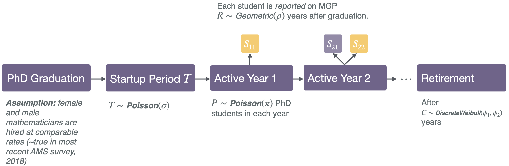{fig-align="center"}

**Assumptions**: 

- Startup depends on subfield. 
- Career length depends on gender. 
- \# students per year depends on subfield and gender.

##

#### Latent variable model

We model an observed sequence of students $\color{#086788}{\mathbf{S}} = (\color{#086788}{S}_1, \color{#086788}{S}_2, \ldots, \color{#086788}{S}_T)$ produced by an advisor as a function of an *unobserved* advisor career $\color{#07A0C3}{C}$ specified by the startup period length and retirement year. 

::: {.big-equation}

$$
\begin{aligned}
  p(\color{#086788}{\mathbf{S}};\color{#F25C54}{\boldsymbol{\theta}}) &= \sum_{\color{#07A0C3}{C}\in\mathcal{C}} p(\color{#086788}{\mathbf{S}}|\color{#07A0C3}{C};\color{#F25C54}{\boldsymbol{\theta}})p(\color{#07A0C3}{C};\color{#F25C54}{\boldsymbol{\theta}}) 
\end{aligned}
$$

:::

We learn $\color{#F25C54}{\boldsymbol{\theta}}$ using a hybrid expectation-maximization algorithm: some parameters can be estimated efficiently via EM, while others must be estimated by direct gradient methods. 

##

##### Men have estimated careers ~4 years longer (on average)

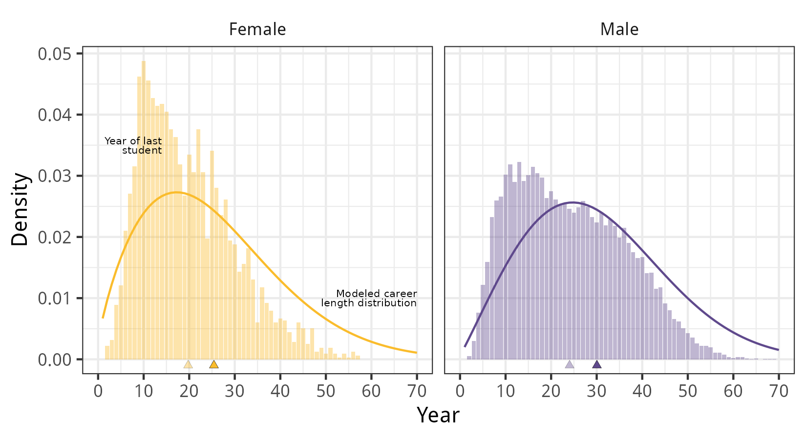{.absolute height=450 left=-40 }

:::{.textblock-vertical .fragment .absolute right=20 top=220}

[**Attrition**]{.alert}

*Addressing disparities in career attrition for female faculty would help to close the gender gap.* 

:::

[  Qualitative match to Barrett-Walker et al. (2023).]{.footnote}

## 

##### Longer careers $\times$ more students per year = more students per career

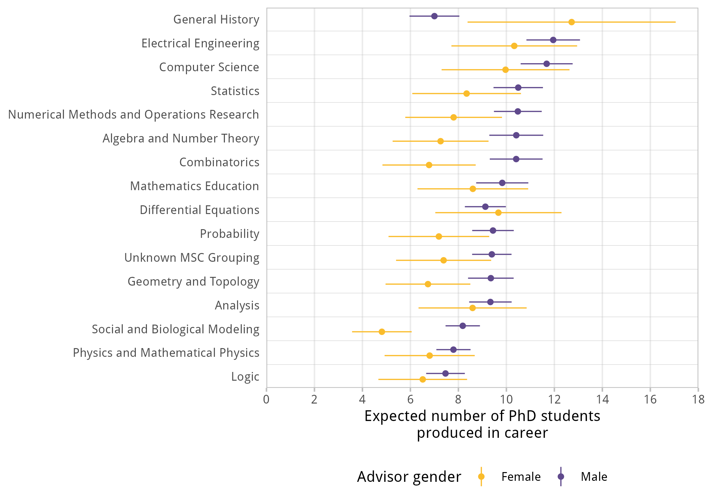{fig-align="center"}

:::{.textblock .fragment}

We hypothesize that greater student production per year by male advisors reflects unequal access to research resources; cf. Zhang et al. (2022)

:::

##

### Logistic model for advisee gender

Estimate the odds that the next student produced by an advsior is female based on subfield, advisor gender, and representation of women in advisor group and subfield.

$$
\begin{aligned}
  \log (\text{odds F}) = & \beta_0 \;+ \\ 
                         & \rho \times (\text{advisor is F}) \;+ \\
                         & \gamma \times (\text{proportion F advisees in group}) \;+ \\ 
                         & \eta \times (\text{proportion F in subfield})  &\quad \phantom{\eta = -3.27 \; (0.12)}\\ 
\end{aligned}
$$  

*We tried a lot of other models with other features (e.g. decade, nonlinear transformations, etc) but this one was near-best (and simplest) in cross-validation among those without an explicit term for the topic of the subfield*. 

##

### Logistic model for advisee gender

Estimate the odds that the next student produced by an advisor is female based on subfield, advisor gender, and representation of women in advisor group and subfield.

$$
\begin{aligned}
  \log (\text{odds F}) = & \beta_0 \;+ &\quad \beta_0 &= -2.14 \; (0.04)\\ 
                         & \rho \times (\text{advisor is F}) \;+ &\quad\rho &= \phantom{-}0.42 \;(0.02)\\
                         & \gamma \times (\text{proportion F advisees in group}) \;+ &\quad \gamma &= \phantom{-}1.16\; (0.06)\\ 
                         & \eta \times (\text{proportion F in subfield})  &\quad \eta &= \phantom{-}3.27 \; (0.12)\\ 
\end{aligned}
$$  

<table>

<tr>
<td style="padding:0.5rem;border-bottom:0px">

:::{.textblock-vertical .fragment  fragment-index=1}

[**Mentorship**]{.alert}

*Female advisors are more effective in attracting or retaining female graduate students.*
:::

</td>
<td style="padding:0.5rem;border-bottom:0px">

:::{.textblock-vertical .fragment fragment-index=1}

[**Belonging**]{.alert }

*Greater representation in the grad student community attracts women to programs and subfields.*

:::

</td>

</tr>

</table>

## {.split-40}

::: {.column}

##### Homophily effects: advisor-student and student-student

Both the gender of a students' specific advisor *and* the overall proportion of female advisors in the subfield's population contribute to the likelihood that the student is female. 

*High uncertainty in the model predictions for large $p_F$ reflects the fact that we have very little data in that region.* 

:::

::: {.column}

   

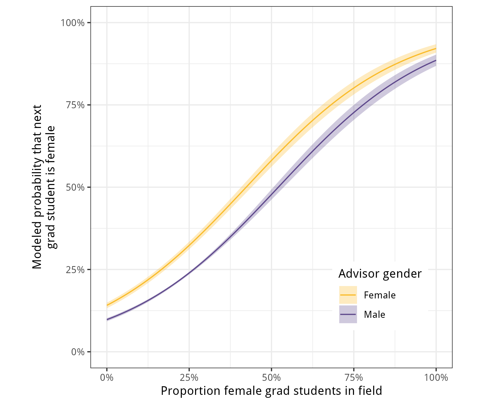{.absolute top=100 right=50 width=140%}

:::

## {.split-40 background-color="#f5f5dc"}

##### Interlude: The Cool Math  Story I Wanted To Tell You

::: {.column}

    

If $p^*$ is the stationary proportion of graduates in the subfield, then $p^*$ approximately satisfies
$$
\begin{aligned}
  p^* = \color{#ffaf03}{w_f}\color{#ffaf03}{\sigma_f}(p^*) + \color{#5b427c}{w_m} \color{#5b427c}{\sigma_m}(p^*)  
\end{aligned}
$$

$\sigma_g(p^*)$: prob. next student of an advisor of gender $g$ is female. 

$w_g$: proportion of students in subfield advised by advisors of gender $g$ (estimated from advisor production model).

[Mean-field assumption: advisor groups have same demographics as advisor's subfield.]{.footnote} 

:::

::: {.column}

  

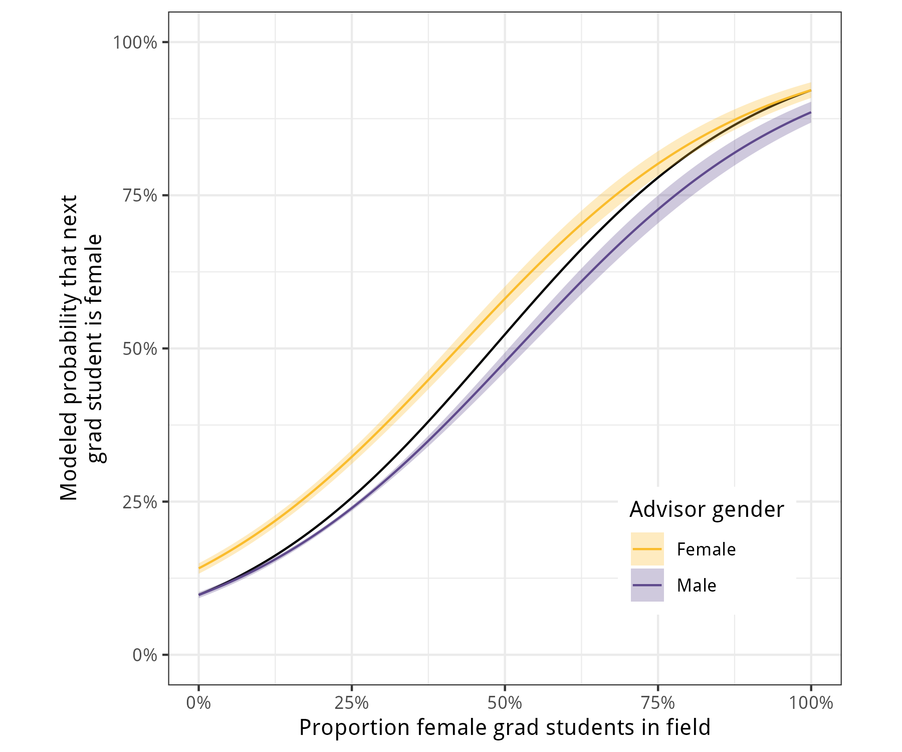{.absolute top=100 right=50 width=140%}

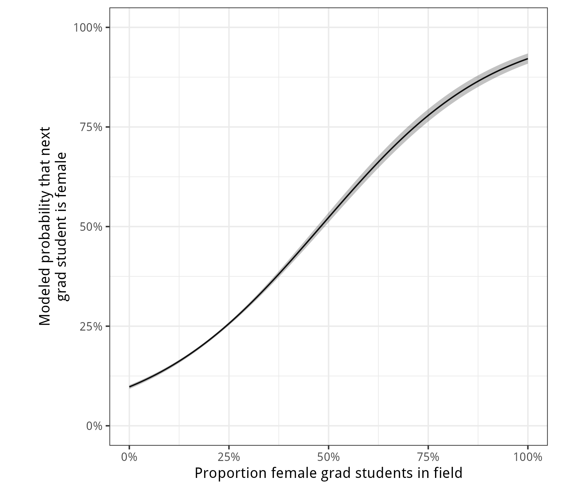{.absolute top=100 right=50 width=140% .fragment}

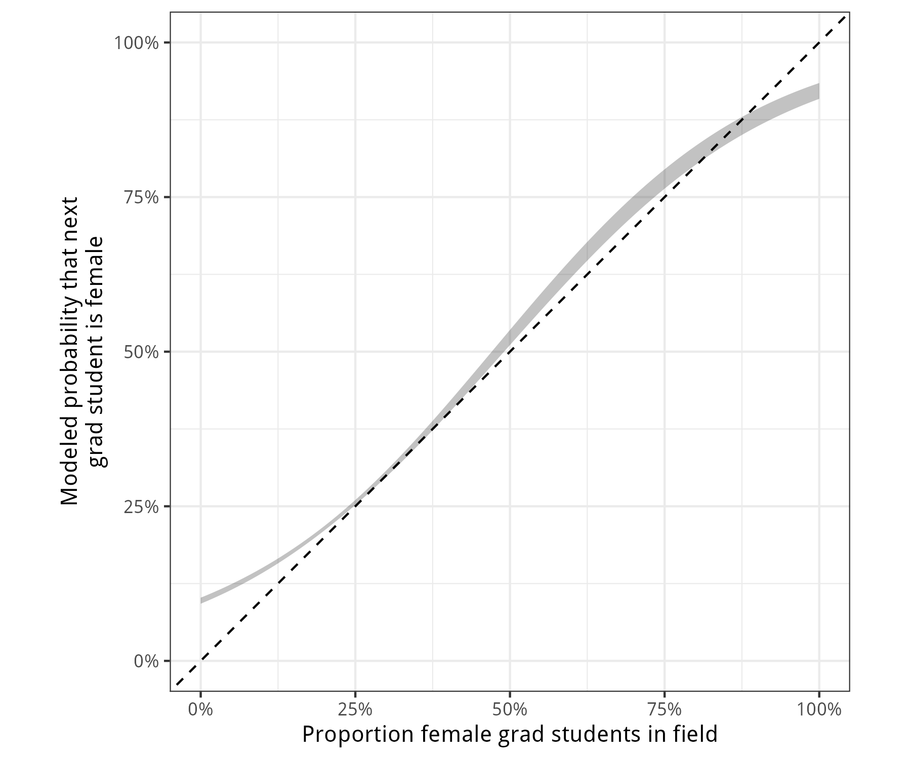{.absolute top=100 right=50 width=140% .fragment}

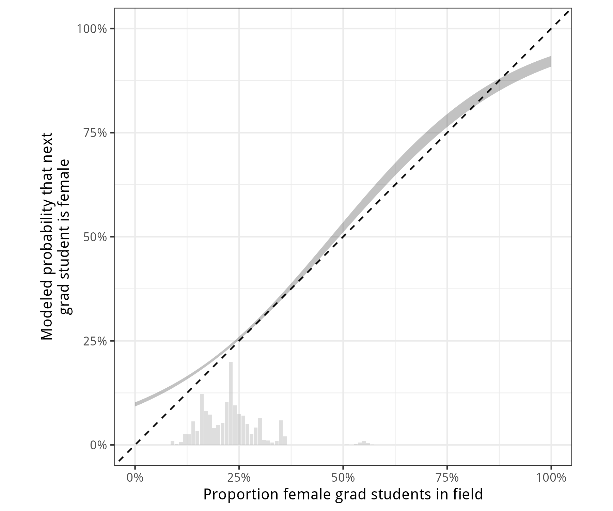{.absolute top=100 right=50 width=140% .fragment}

:::

## {.split-30}

##### Instead: What might we expect near-to-medium term?

::: {.column}

              
*100 simulations initialized with 1,000 active advisors who received PhDs over period 1980-2000, 20% female.*

:::

::: {.column}

  

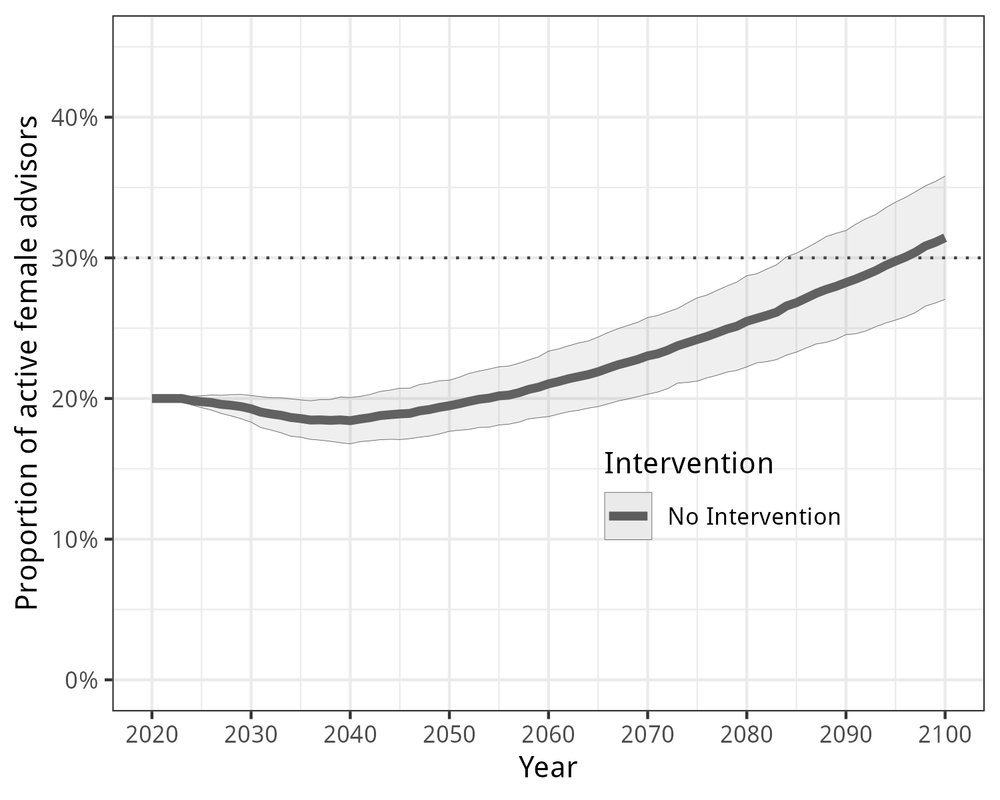{.absolute top=100 right=50 width=100%}

                              

:::

## {.split-50}

##### Modeling Interventions on Attrition and Student Production

::: {.column}

    

::: {.textblock}

**[Attrition Hypothesis]{.alert}**

*Addressing disparities in career attrition for female faculty would help to close the gender gap.*

:::

::: {.textblock-inverse .fragment}

**[Approach]{.alert}**

Equalize career length and student production parameters over a 10-year intervention period. 

:::
:::

::: {.column}

    

::: {.fragment}

##### Intervention: 2025-2035

- **Faculty only**: Female faculty *during* the intervention period gradually change career and production parameters to match those of their male colleagues. 
- **Students only**: Starting in the intervention period and continuing thereafter, graduating female students adopt the same career and production parameters as their male counterparts. 
- **Both**: Both. 

:::

:::

## {.split-40}

#### Modeling Interventions on Medium Timescales

::: {.column}

::: {.textblock .fragment .fade-in-then-out .absolute left=20 top=150 style="background-color:#5c5c5c;" fragment-index=1}

[**No Intervention**]{.alert}

:::

::: {.textblock .fragment .fade-in-then-out .absolute left=20 top=150 style="background-color:#0da05b;" fragment-index=2}

[**Faculty Intervention**]{.alert}

Parameters are equalized over a 10-year period for active *advisors* during that period. 

:::

::: {.textblock .fragment .fade-in-then-out .absolute left=20 top=150 style="background-color:#a971ce;" fragment-index=3}

[**Student Intervention**]{.alert}

Parameters are equalized for *students* graduating during the intervention period and thereafter.

:::

::: {.textblock .fragment .absolute left=20 top=150 style="background-color:#dd6b8f;" fragment-index=4}

[**Both**]{.alert}

Parameters are equalized for both active faculty and students graduating during the intervention period and thereafter.

:::

:::

::: {.column}

{.absolute top=120 right=50 width=90% .fragment fragment-index=1}

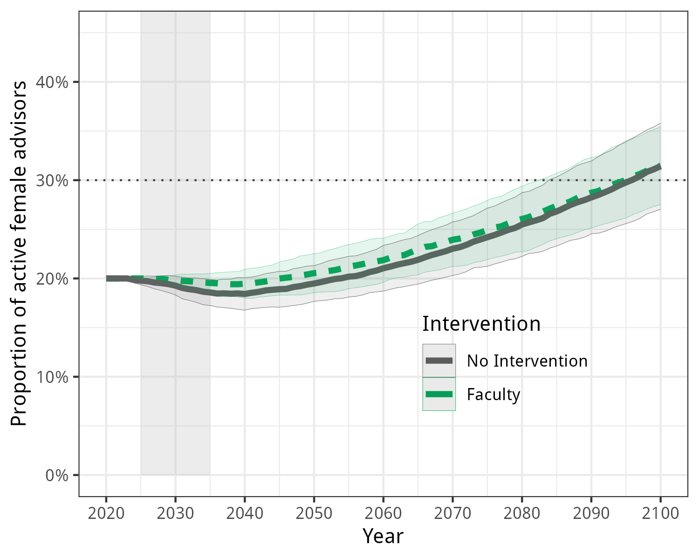{.absolute top=120 right=50 width=90% .fragment fragment-index=2}

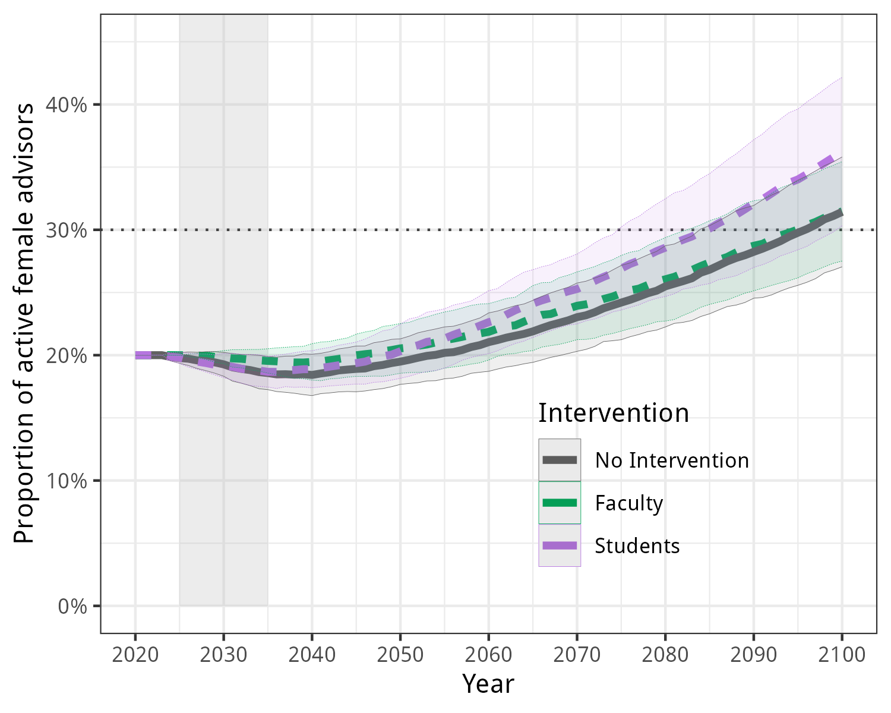{.absolute top=120 right=50 width=90% .fragment fragment-index=3}

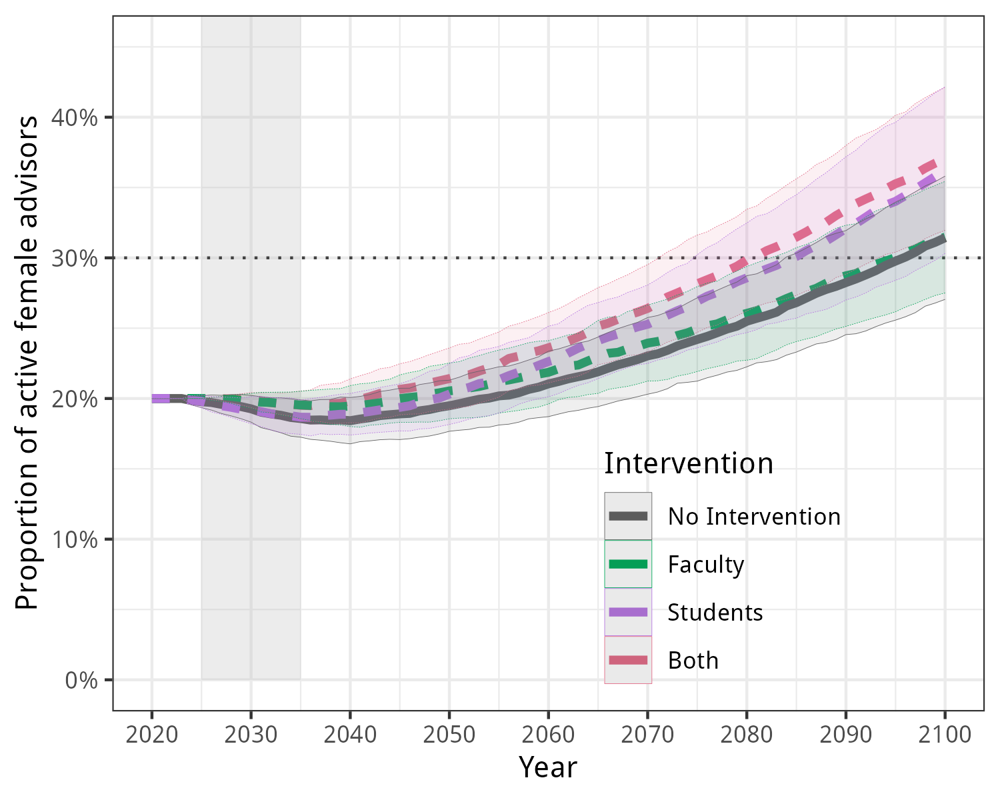{.absolute top=120 right=50 width=90% .fragment fragment-index=4}

:::

##

### Looking Back on Our Hypotheses

## 

### Looking Back on Our Hypotheses

<table>

<tr>
<td style="border-bottom:0px;margin:0px;">

:::{.textblock .fragment .semi-fade-out fragment-index=3 style="width:90%;"}

[**Mentorship**]{.alert}: *Female advisors are more effective in attracting or retaining female graduate students.*

:::

</td>

<td style="border-bottom:0px">
::: {.textblock-inverse .fragment .fade-in-then-semi-out fragment-index=2 style="width:90%;"}

[**Yes!**]{.alert} Female advisors are ~30% more likely than male advisors to produce female PhD graduates. 

:::
</td>

</tr>

<tr>

<td style="border-bottom:0px;margin:0px;">

::: {.fragment .semi-fade-out fragment-index=5}

:::{.textblock .fragment .fade-in fragment-index=3 style="width:90%;"}

[**Belonging**]{.alert }: *Representation in the grad student community attracts women to programs and subfields.*

:::
:::

</td>
<td style="border-bottom:0px;margin:0px;">
::: {.textblock-inverse .fragment .fade-in-then-semi-out fragment-index=4 .font_smaller style="width:90%;"}

[**Yes!**]{.alert} Subfields/advisor groups with greater representation of women tend to attract more women. 

:::
</td>

</tr>

<tr>

<td style="border-bottom:0px;margin:0px;">

::: {.fragment .semi-fade-out fragment-index=7}

:::{.textblock .fragment .fade-in fragment-index=6 style="width:90%;"}
[**Attrition**]{.alert}:*Addressing disparities in career attrition for female faculty would help to close the gender gap.* 

:::

:::
</td>

<td style="border-bottom:0px;margin:0px;">
::: {.textblock-inverse .fragment .fade-in-then-semi-out fragment-index=7 style="width:90%;"}

[**Yes!**]{.alert} This is an intrinsically inclusive goal AND may accelerate progress by 10-20 years.  

:::
</td>

</tr>

</table>

{.absolute .fragment fragment-index=5 top=200  width=20% left=420}

{.absolute .fragment fragment-index=8 top=400  width=20% left=420}

## {background-image="fig/tree.png" background-size="contain" background-position="center" background-repeat="no-repeat"}

### Next?

## 

#### Thanks everyone!

  

<table style="padding:0px;border-bottom:0pxmargin: 0px auto; ">
<tr style="border:0px;padding:0px;margin:0px;">
<td style="padding:0px;border-bottom:0px"> 
{.portrait-smaller} 
</td>
<td style="vertical-align: middle;white-space:nowrap;padding:0px;border-bottom:0px">

**Heather Brooks**   Harvey Mudd

</td>

<td style="vertical-align: middle;padding:0px;border-bottom:0px"> 
{.portrait-smaller} 
</td>
<td style="vertical-align: middle;white-space:nowrap;padding:0px;border-bottom:0px">

**Harlin Lee**   UNC Chapel Hill

</td>

<td style="vertical-align: middle;padding:0px;border-bottom:0px"> 
{.portrait-smaller} 
</td>
<td style="vertical-align: middle;white-space:nowrap;padding:0px;border-bottom:0px">

**Mason Porter**   UCLA

</td>
</tr>

<tr>

<td style="vertical-align: middle;padding:0px;border-bottom:0px"> 
{.portrait-smaller} 
</td>
<td style="vertical-align: middle;white-space:nowrap;padding:0px;border-bottom:0px">

**Juan G. Restrepo**   CU Boulder

</td>

<td style="vertical-align: middle;padding:0px;border-bottom:0px"> 
{.portrait-smaller} 
</td>
<td style="vertical-align: middle;white-space:nowrap;padding:0px;border-bottom:0px">

**Anna Haensch**   Tufts

</td>

<td style="vertical-align: middle;padding:0px;border-bottom:0px"> 
{.portrait-smaller} 
</td>
<td style="vertical-align: middle;white-space:nowrap;padding:0px;border-bottom:0px">

***Ben Brill***   *UCLA '22*

</td>

</tr>

</table>

<table>
<tr>
<td style="padding:0px;border-bottom:0px">
{.portrait-small}
</td>
<td style="vertical-align: middle;white-space:nowrap;padding:0px;border-bottom:0px">

 National Science Foundation 

</td>
<td style="padding:0px;border-bottom:0px">
{.portrait-small}
</td>
<td style="vertical-align: middle;white-space:nowrap;padding:0px;border-bottom:0px">

 ICERM \@Brown   Two summer programs!

</td>
</tr>
</table>

*Preprint coming soon* 😬😬😬

## 

               

### Extra Slides

## {background-image="fig/phase-portrait-binned.png" background-size="contain" background-position="center" }

[Many math subfields are on   qualitatively similar trajectories.]{.absolute right=75 top=100}

[*Six largest subfields by record count.*]{.absolute right=150 bottom=100}

