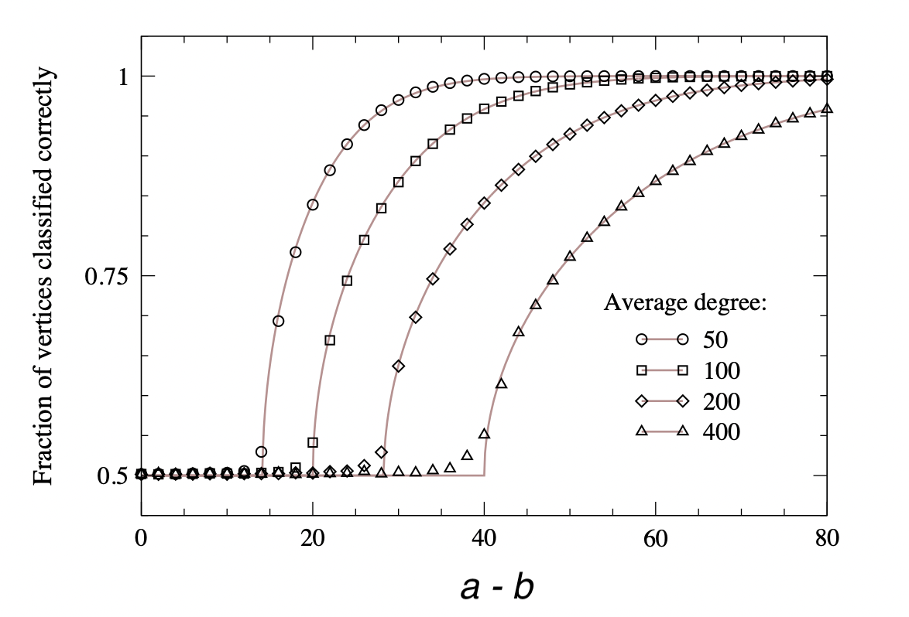
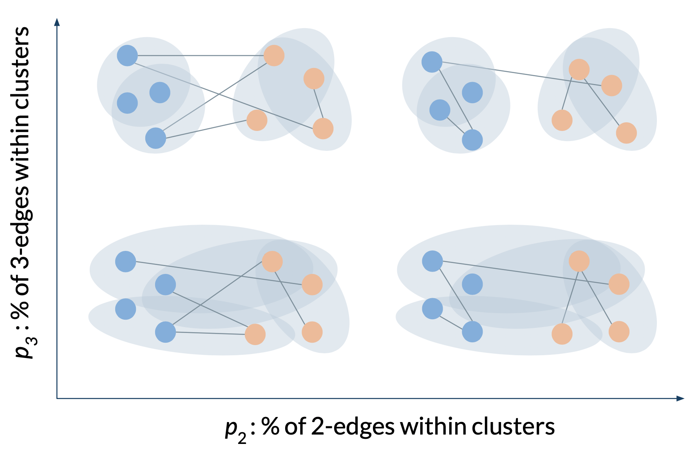
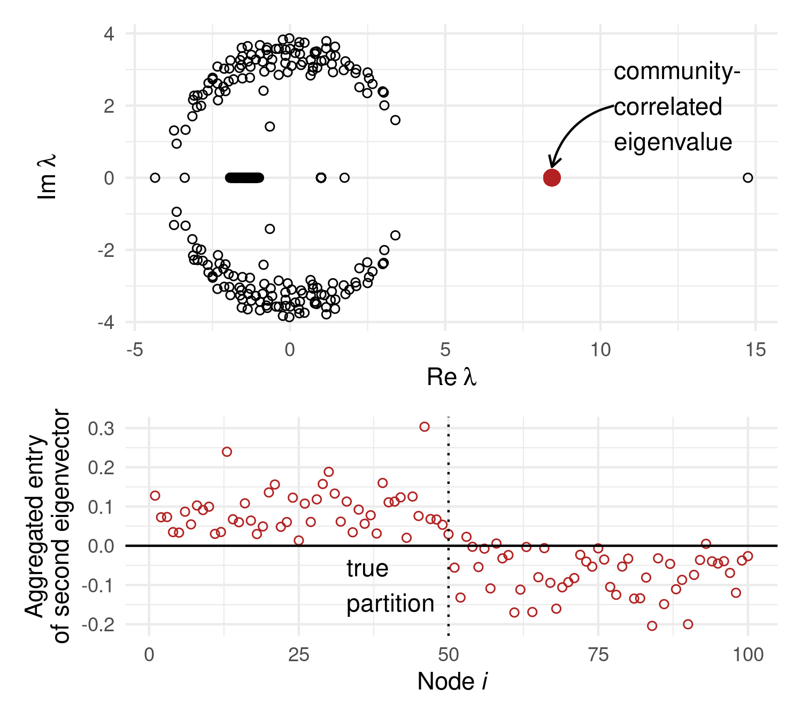
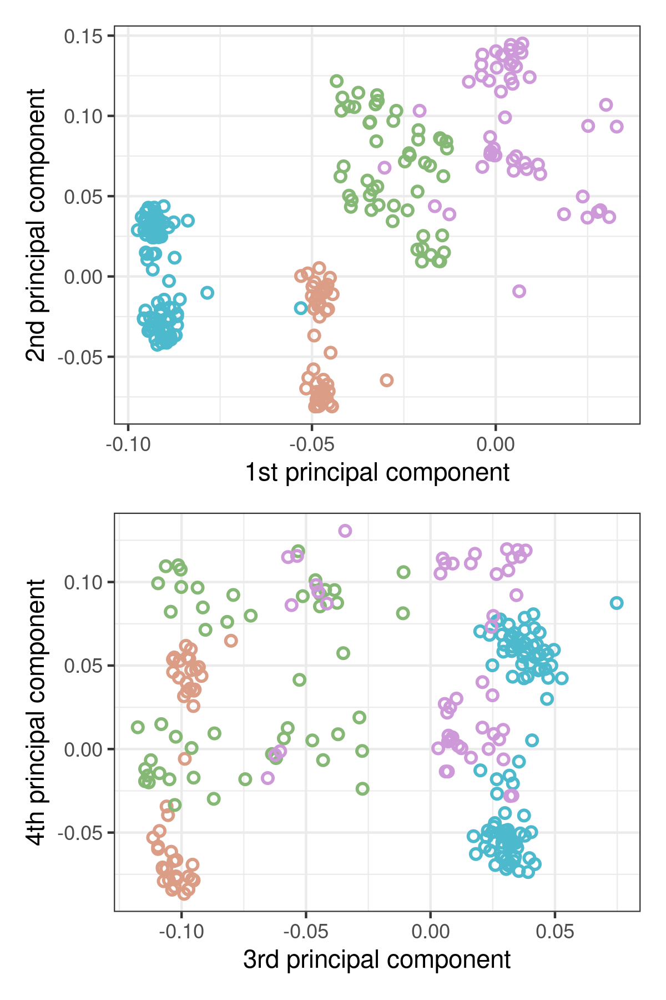
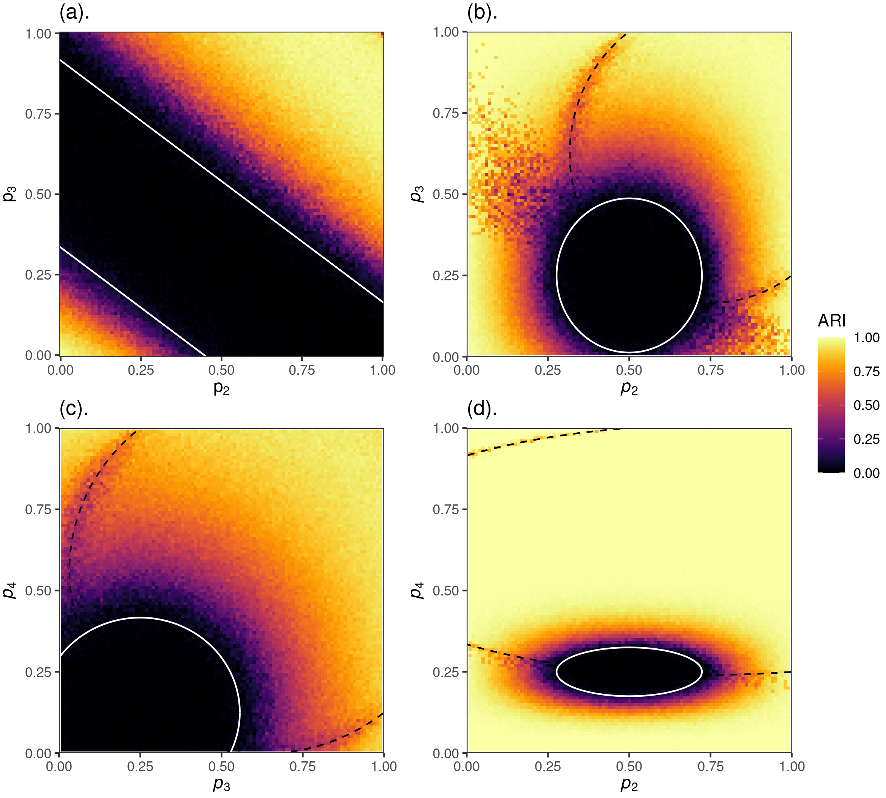

exclude: true   
<style type="text/css">
code.r{ 
  font-size: 16px; 
}
pre {
  font-size: 16px !important;  
}
</style>
```{r setup, include=FALSE}
options(htmltools.dir.version = FALSE)
```

```{r run, eval=FALSE, include=FALSE}
# xaringan::inf_mr("middlebury-2022/index.rmd")
``` 


---

layout: false
class: split-two

.column.bg-main1[
  ### The Hypergraph Clustering Problem 

  Given some hypergraph data, assign each node to a .alert[*cluster*] of related nodes. 
  <br> <br>
  Emphasis for today: .alert[spectral algorithms] and conjectured .alert[theoretical limits]. 

  .alert2[Preprint]: <br>
  <b>PSC</b>, N. Eikmeier, J. Haddock, (2022). Nonbacktracking spectral clustering of nonuniform hypergraphs, <i>arXiv:2204.13586</i>

  
  
]

  
]
.column[.content.vmiddle[.stretch[
  
]]]

---

class: split-two

.column.bg-main1[
  ### What We Know About Graphs

Random graph (stochastic blockmodel) with two groups. 

Nodes have on average $a$ neighbors within-cluster and $b$ neighbors between clusters. 

.alert[Theorem]: Finding clusters correlated with ground-truth is possible as number of nodes $n\rightarrow \infty$ iff

$$\frac{1}{2}\frac{(a - b)^2}{a + b} > 1\;.$$

.footnote[
  Conjecture by Decelle et al., *PRE* 2022. <br>
  Proof by Mossel et al., *Combinatorica* 2018. 
]

]
.column[.content.stretch[
  <br> 
  
  
  
]
.footnote[
  Images from Nadakuditi + Newman, *PRE* 2012 <br>  
  Abbe et al., *IEEE Trans. Info. Theory* 2014. 
]
]

---

class: 

### A Testbed for Sparse Hypergraph Clustering




---

class: split-two
layout: true

.column[

## Synthetic Testbed

<br> <br>
   
]

.column[.stretch[ 
  {{content}}
]]


---

   

---

## Louvain-Type Algorithm

<br>
   

Adjusted Rand Index (ARI): 

- ARI = 1: perfect clustering. 
- ARI = 0: random noise.


---
class: split-50 bg-main1 
layout: false 
 
.row[ 
.split-three[
.column[<br><br>
   
]
.column[<br><br>
   
  ]
.column[<br><br>
     
] 

]
]
.row[ 
.split-three[
.column[<br>
  .font_large[.alert-no-bold[<nobr>Nicole Eikmeier</nobr>]]
   Computer Science <br> Grinnell College      
   .alert2[@NicoleEikmeier]
]
.column[<br>
  .font_large[.alert-no-bold[<nobr>Jamie Haddock</nobr>]]
  <nobr>Mathematics</nobr> <br> Harvey Mudd College      
  .alert2[@jamie_hadd]
]  
.column[<br>
  .font_large[.alert-no-bold[<nobr>Phil Chodrow</nobr>]]
  <nobr>Computer Science</nobr> <br> Middlebury College
  <br> .alert2[@PhilChodrow] <br>
]
]
]

---


class: split-two
layout: false

.column.bg-main1[

### Matrices for Hypergraphs? 

We could transform the hypergraph into a graph.
- .alert[Problem]: loses multi-way information.

We could construct a set of adjacency tensors $\mathbf{A}^{(2)}$, $\mathbf{A}^{(3)}$, $\mathbf{A}^{(4)}$...

$$a^{(3)}_{ijk} = \begin{cases} 1 &\quad (i,j,k)\in \mathcal{E} \\ 0 &\quad \text{otherwise...}\end{cases}$$

- .alert[Problem]: we know eigenvectors of tensors, but not .alert[*sets*] of tensors.

So, what should we do?....


]

.column[
  <br> <br>
  
]


---

class: split-two
layout: false


.column.bg-main1[
## The Nonbacktracking Operator

<!-- The adjacency matrix is $n\times n$ and  operates on nodes.  -->

The .alert[nonbacktracking operator] $\mathbf{B}$ is a matrix that operates on *edge-node pairs*. 

Define relation $(e_1, v_1) \rightarrow (e_2, v_2)$: 

- $v_1 \in e_1$ and $v_2 \in e_2$
- $v_1 \in e_2 \setminus v_2$
- $e_1 \neq e_2$

.font_smaller[ .font_smaller[
$$\mathbf{B}[(e_1, v_1), (e_2, v_2)] = \begin{cases} 1 &\quad (e_1, v_1) \rightarrow (e_2, v_2) \\ 
0 &\quad \text{otherwise.}\end{cases}$$
]]
.footnote[.font_smaller[
  Proposed for hypergraphs by Storm (2006). "The zeta function of a hypergraph," *The Electronic Journal of Combinatorics*. 
]]
]


.column[
<br>


"I can get to $v_2 \in e_2$ from $e_1$ by passing through $v_1$. I can get to $v_3 \in e_3$ from $e_2$ by passing through $v_2$..."

]

???

The important intuition here is: 

- We can imagine a walk stepping from a node to a hyperedge and on to a new node, and on to a new hyperedge, and so on. 
- The conditions ensure that we never hit the *same* node or the *same* hyperedge in consecutive steps. 

---

class: split-two


.column.bg-main1[

<br> <br> 
**Theorem (PSC, JH, NE '22)**: In a random graph (stochastic blockmodel) with two equal-sized clusters, within-cluster $k$-degree $c_k^{\mathrm{in}}$ and between-cluster $k$-degree $c_k^{\mathrm{out}}$, the nonbacktracking operator $\mathbf{B}$ has, in expectation, an eigenpair $(\beta, \mathbf{v})$ where 

$$
\beta = \frac{1}{2}\sum_{k \in \text{edge sizes}} (a_k - b_k)\;,
$$
such that $\mathbf{v}$ is correlated with clusters. 


.footnote[
    Stronger version for uniform hypergraphs proven by <br> 
    Stephan and Zhu (2022) Sparse random hypergraphs: Non-backtracking spectra and community detection, <i> arXiv:2203.07346</i>
]
]

.column[
  <br> <br> <br> 

]


---

class: split-two
layout: true

.column[

## Synthetic Testbed

<br> <br>
   
]

.column[.stretch[ 
  {{content}}
]]


---

## Louvain-Type Algorithm

<br>
   

Adjusted Rand Index (ARI): 

- ARI = 1: perfect clustering. 
- ARI = 0: random noise.


---

## Spectral Algorithm

<br>
   

Adjusted Rand Index (ARI): 

- ARI = 1: perfect clustering. 
- ARI = 0: random noise.

---

layout: false
class: split-two

.column.bg-main1[

### The Belief-Propagation Jacobian

<br> 
.alert[Belief-propagation] is a method for learning probabilistic machine learning models, but it's very expensive on hypergraphs. 

We can approximate BP by computing eigenvectors of the .alert[Jacobian matrix], evaluated at an uninformative fixed point.  

Eigenvectors of the Jacobian (sometimes) give useful cluster information.  

.footnote[
  Discussion of graph case in
  Krzakala et al., *PNAS* 2013
]

]
.column[
  

### &nbsp; 

<br> 
**Theorem (PSC, JH, NE '22)**: In a sparse random hypergraph stochastic blockmodel with communities of equal expected degrees, 

  $$\mathcal{J} = \sum_{k = 1}^{\bar{k}} \mathbf{C}_k \otimes \mathbf{B}_k + O(n^{-1})\;,$$

  - $\mathbf{C}_k$ is a matrix of parameters that depends on the affinity function $\Omega$. 
  - $\mathbf{B}_k$ is our friend the nonbacktracking operator, restricted to edges of size $k$. 
  - $\otimes$ is the matrix Kronecker product. 


<!-- .footnote[
  .alert2[Shown for graphs by]: <br> Krzakala et al. (2013)  Spectral redemption in clustering sparse networks, <i>PNAS</i> 110 (52) 20935-20940
] -->
]

---

class: split-two

## An Ihara-Bass Theorem for the BP Jacobian

$\mathbf{J} = \sum_k \mathbf{C}_k\otimes\mathbf{B}_k \approx \mathcal{J}$ can be a very large matrix $\implies$ slow eigenvalue computations. 

**Theorem (PSC, JH, NE '22)**: Under mild conditions, if $\lambda$ is an "interesting" eigenvalue of $\mathbf{J},$ then $\lambda$ is also an eigenvalue of the $2n\ell\bar{k} \times 2n\ell\bar{k}$ matrix

.font_smaller[.font_smaller[
$$\mathbf{J}' = (\mathbf{I}_2 \otimes \mathbf{G}\otimes \mathbf{I}_n) \left[\begin{matrix} 
\mathbf{0} & \mathbf{I}_\ell \otimes \mathbb{D} \\ 
\mathbf{0} & \mathbf{I}_\ell \otimes \mathbb{A}
\end{matrix}\right] - (\mathbf{I}_2 \otimes \mathbf{H}\otimes \mathbf{I}_n)  \left[\begin{matrix} 
\mathbf{0} & \mathbf{I}_{\ell k n} \\ 
\mathbf{I}_\ell \otimes (\mathbf{K} - \mathbf{I}_{\kappa}) \otimes \mathbf{I}_n  & \mathbf{I}_\ell \otimes (\mathbf{K} - 2\mathbf{I}_{\kappa})\otimes \mathbf{I}_n
\end{matrix}\right]$$
]
]

- $\ell$ is the number of clusters and $\kappa$ the number of distinct edge sizes. 
- $\mathbf{G}$, $\mathbf{H}$ hold statistical parameters
- $\mathbb{D}$ is a degree operator,  $\mathbb{A}$ is an adjacency operator,  and $\mathbf{K}$ is a diagonal matrix containing the possible edge sizes.   

.footnote[
  Similar in spirit to a famous result by Bass, *Int. J. Math* 1992.  
]

<!-- ---


class: split-two

.column.bg-main1[

### Belief-Propagation Spectral Clustering

<br> 

1. Start with a guess about $\mathbf{C}_k$ and form $\mathbf{J}'$. 
2. Compute the .alert[leading eigenvectors] of $\mathbf{J}'$ with real eigenvalues. 
3. For each eigenvector $\mathbf{v} = (\alpha, \beta)$, compute $u_{i\ell} = \mathbb{1}\left(\sum_{k = 1}^{\bar{k}} \alpha_{ik}^{(\ell)} > 0\right)$. 
4. Use a .alert2[Euclidean clustering algorithm] (like $k$-means) in the space spanned by the vectors $\{\mathbf{u}\}$. 
5. Re-estimate $\mathbf{C}_k$ and repeat...

]


.column[.vmiddle[.center[

 

]]]


 -->


---

background-image: url(../img-lib/algorithm-demo.png)
background-size: contain

### Belief-Propagation Spectral Clustering

---

class: split-two
layout: true

.column[

## Synthetic Testbed

<br> <br>
   
]

.column[.stretch[ 
  {{content}}
]]

---

class: 

## Plain Spectral

<br>
   

Adjusted Rand Index (ARI): 

- ARI = 1: perfect clustering. 
- ARI = 0: random noise.

???

Recall that we wanted to *fill in the gaps*. 

---

class: 

## BP Spectral

<br>


Adjusted Rand Index (ARI): 

- ARI = 1: perfect clustering. 
- ARI = 0: random noise.

???

Oops! Uh, new gaps. Time to take a detour for some more advanced machinery. 

---

class: 

## BP Spectral


<br>


Adjusted Rand Index (ARI): 

- ARI = 1: perfect clustering. 
- ARI = 0: random noise.


---

layout: false
class: split-two

.column.bg-main1[
### Detectability (Algorithmic)

.font_smaller[
**Conjecture**: In a 2-group blockmodel with edge sizes $k_1,k_2,\ldots$ and $c_k$ edges of size $k$ per node, .alert[spectral clustering] fails to detect clusters in the ellipsoid with centroid $(x_{k_1},x_{k_2},\ldots)$ and radii $(r_{k_1},r_{k_1}\ldots)$, where: 


$$
\begin{align}
x_k &= \frac{1-f_k}{2-f_k}  \\ 
r_k &= \frac{\sqrt{(k-1)c_k}}{2-f_k} \\
f_k &= \frac{1-2^{2-k}}{1-2^{1-k}}\;.
\end{align}
$$
]

.footnote[Proof requires controlling spectrum of Hashimoto operator, possibly generalizing approach used by Bordenave et al., *Annals of Probability* 2018
]

]

.column[.stretch[
.center[ <br> <br> <br>

]
]
]

---

class: split-two

.column.bg-main1[
### Detectability (Fundamental)

.font_smaller[
**Conjecture**: In a 2-group blockmodel with edge sizes $k_1,k_2,\ldots$ and $c_k$ edges of size $k$ per node, .alert[any algorithm] fails to detect clusters in the ellipsoid with centroid $(x_{k_1},x_{k_2},\ldots)$ and radii $(r_{k_1},r_{k_1}\ldots)$, where: 


$$
\begin{align}
x_k &= \frac{1-f_k}{2-f_k}  \\ 
r_k &= \frac{\sqrt{(k-1)c_k}}{2-f_k} \\
f_k &= \frac{1-2^{2-k}}{1-2^{1-k}}\;.
\end{align}
$$
]

.footnote[Generalizes recent theorem for graph blockmodels by Mossel et al., *Combinatorica* 2018
]

]

.column[.stretch[
.center[ <br> <br> <br>

]
]
]


---

class: split-two
layout: false

.column.bg-main1[

## Summing Up

<br>

Belief-propagation spectral clustering can help us form conjectures about when detecting clusters is .alert[even possible].  

Proving these conjectures is likely to require some powerful machinery from random matrix theory and discrete probability. 

The structure of the nonbacktracking operator enables us to make useful simplifications towards fast computations. 

]

.column[.stretch[
.center[ <br> <br> <br>

]
]
]


---

class: split-two

.column.bg-main1[
# **Thanks!**
.row[ 
.split-two[
.column[.lil-stretch[<br><br><br><br> 
   
  .alert[**Nicole Eikmeier**] <br> Grinnell 
  ]
  ]
.column[
  .lil-stretch[<br><br><br><br>
   
  .alert[**Jamie Haddock**] <br> Harvey Mudd 
  ]
]]]

<br><br><br><br><br><br><br><br><br>
<b>PSC</b>, N. Eikmeier, J. Haddock, (2022). Nonbacktracking spectral clustering of nonuniform hypergraphs, <i>arXiv:2204.13586</i>
]


.column[ 

<br> <br> <br> <br> <br> 

# Questions?

(maybe you want to see this algorithm on [real data](#data-slide)...?)

]

---

class: middle bg-main4  

# Extra slides


---

name: data-slide

## High School Social Contacts 

<br> 

  $n = 327$ students (nodes) in a French high school. 

  $m = 7,818$ social contact events (edges) measured by wearable 
  sensors.   

  Average number of participants in interaction $\langle k \rangle = 2.3$ 

  Cluster labels are the classes to which students are assigned. 


  <div class="footnote">
    Data originally from: <br>
    R. Mastrandrea et al. (2015), Contact patterns in a high school: A comparison between data collected using wearable sensors, contact diaries, and friendship surveys. <i>PLoS One</i> 10:9, e0136497
    <br> <br> 
    Prepared by 
    A. R. Benson et al. (2018), Simplicial closure and higher-order link prediction. <i>Proceedings of the National Academy of Sciences</i> 10.1073/pnas.1800683115  
  </div>

---
background-image: url(../img-lib/contact-high-school-classes.png)
background-size: contain

## High School Social Contacts 

---

## On the Other Hand...Senate Bills

<br> 

  $n = 293$ U.S. senators (nodes) cosponsoring bills.

  $m = 20,006$ bills (edges) in period 1973-2016.

  Average number of cosponsors $\langle k \rangle = 7.3$.

  Cluster labels are Democrat/Republican. 


<div class="footnote">
  Data originally from: <br>
  J. Fowler (2006), Legislative cosponsorship networks in the U.S. House and Senate. <i>Social Networks</i> 28:4, 454--465
  <br> <br> 
  Prepared by 
  A. R. Benson et al. (2018), Simplicial closure and higher-order link prediction. <i>Proceedings of the National Academy of Sciences</i> 10.1073/pnas.1800683115  
</div>


---
background-image: url(../img-lib/SN-congress-bills.png)
background-size: contain

## Senate Bills

---
class: bg-main2

<br> <br> <br> <br>  
### .alert[Big Picture]: you want hypergraph methods when edges of different sizes give you different information about the cluster structure. 
