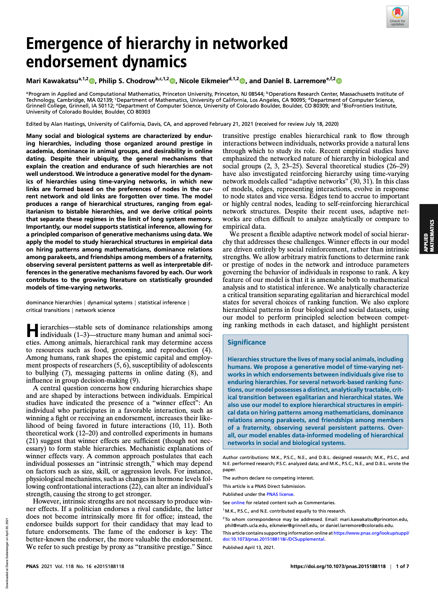
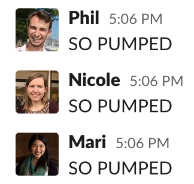
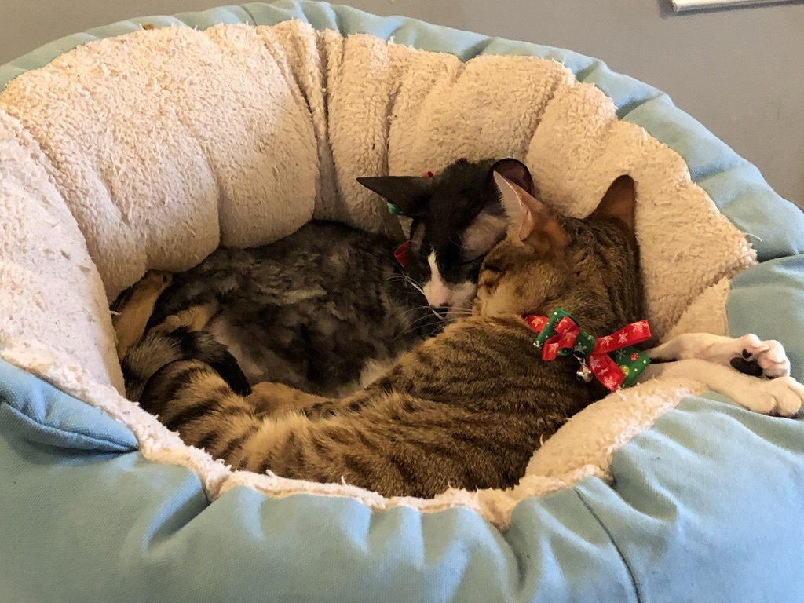

exclude: true
<style type="text/css">
code.r{ 
  font-size: 16px; 
}
pre {
  font-size: 16px !important;
}
</style>
```{r setup, include=FALSE}
options(htmltools.dir.version = FALSE)
```

---

# Science begins with... 

<br> 

--
 
## Inspiration

--

## Data

--

## Grant funding


---


# Science begins with... 

<br> 
 
## ~~Inspiration~~

## ~~Data~~

## ~~Grant funding~~


## .alert[Social anxiety] 🙃

---

### Complex Networks Winter Workshop 2019
<br> <br> <br> 
 
 

Le Monastère des Augustines, Québec City

---

### Complex Networks Winter Workshop 2019
<br> <br> <br> 
 
 

Le Monastère des Augustines, Québec City

---

### Complex Networks Winter Workshop 2019
<br> <br> <br> 
 
 

We're supposed to form groups and work on a project. 

--

It's fun, but also hard and awkward. I don't have an idea I like. =(

---

### Complex Networks Winter Workshop 2019
<br> <br> <br> 
 
 

Eventually, I start hanging out with some other folks at the workshop with math backgrounds. 

---

class: split-two

#### Dan and collaborators have been working on modeling networks of prestige in faculty hiring. 


.column[
<br> <br> <br> 
 
]
.column[
<br> <br> <br> <br> <br> 
 
]

---

### An idea is born!
<br> <br> <br> 
 
 


---

### An idea is born!
<br> <br> <br> 
 
 


---

### An idea is born!
<br> <br> <br> 
 
 

### To the cat cafe! 


---

class: split-30

## No, really....to the cat cafe


.column[
    <br> <br> <br> <br> <br> <br> <br>
     
     
     
     
]

.column[
<br> <br> <br> <br> 
 

Cafe Felin Ma Langue Aux Chats, Québec City
  ]

---

class: split-two

.column.bg-main1[
<br> <br> <br> <br> <br> <br> <br> <br> <br> <br> 
### Idea: prestige is about .alert[rankings] and .alert[feedback] loops

]


.column.bg-main4[.content.center[<br><br>
   
  ]
  .content.font_large[.alert[Example]: 
  College ranks are based partly on selectivity. 
  
  High ranks <br>  $\implies$ more applications <br> $\implies$     higher selectivity <br> $\implies$ even higher ranks....
]]


---

class: split-30

.column.bg-main1[
<br> <br> <br> <br> <br> <br> <br> <br> <br> <br> 
## An .alert[agent-based model]

]

.column[<br> <br> <br> <br> <br> <br> <br> <br> 

Directed network of .alert[endorsements]: $j\rightarrow i$ means <br> " $i$ thinks $j$ is pretty good." 


]

---

class: split-30

.column.bg-main1[
<br> <br> <br> <br> <br> <br> <br> <br> <br> <br> 
## An .alert[agent-based model]

]

.column[<br> <br> <br> <br> <br> <br> <br> <br> 

Directed network of .alert[endorsements]: $j\rightarrow i$ means <br> " $i$ thinks $j$ is pretty good." 

At each timestep, .alert[rankings] are published based on the endorsements: more endorsements $\implies$ higher ranks. 

]

---

class: split-30

.column.bg-main1[
<br> <br> <br> <br> <br> <br> <br> <br> <br> <br> 
## An .alert[agent-based model]

]

.column[<br> <br> <br> <br> <br> <br> <br> <br> 

Directed network of .alert[endorsements]: $i\rightarrow j$ means <br> " $i$ thinks $j$ is pretty good." 

At each timestep, .alert[rankings] are published based on the endorsements: more endorsements $\implies$ higher ranks. 

Nodes make *new* endorsements, with preferences to endorse nodes that are .alert[higher-ranked] nodes but .alert2[not too much higher]. 

]

---

class: split-30

.column.bg-main1[
<br> <br> <br> <br> <br> <br> <br> <br> <br> <br> 
## An .alert[agent-based model]

]

.column[<br> <br> <br> <br> <br> <br> <br> 


]

---

background-size: contain
background-image: url("img/make-it-math.jpeg")

---

class: split-40

.column.bg-main1[<br> <br> <br> <br> <br> <br> <br> <br> <br> <br> 
### We know lots of ways to compute rankings from networks...
]

.column[<br> <br> <br> <br> 
.alert[In-Degree] (Number of endorsements received) 
.color-main4[tab] $$\mathbf{r} = \mathbf{d} = \mathbf{1}^T\mathbf{A}$$ 

<br>

.alert[PageRank] (Google) **r** is leading eigenvector of 
$$\mathbf{P} = \alpha_p\mathbf{D}^{-1}\mathbf{A} + \frac{1}{n}(1-\alpha_p)\mathbf{E}$$

<br>

.alert[SpringRank] (DeBacco et al. 2018) Solve linear system 
$$\left[\mathbf{D}^i + \mathbf{D}^o - (\mathbf{A} + \mathbf{A}^T) + \alpha_s\mathbf{I}\right]  \mathbf{r} = \left[\mathbf{D}^i - \mathbf{D}^o\right]\mathbf{1}$$

*Also known by some researchers as Cats Centrality.*

]

---

class: split-60 bg-main1

.column[

<br> 
## The Model

Matrix $\mathbf{A} = \mathbf{A}^{(t)}$ of *endorsements*: $a_{ij}^{(t)}$ is the weighted number of times $i$ endorses $j$ by time $t$. 

1. Compute rank vector $\mathbf{r} = \sigma(\mathbf{A})$ (degree, PageRank, SpringRank...)
2. Node $i$ computes a *utility* of endorsing $j$:  $$u_{ij} = \color{#63d297}{\beta_1} r_j + \color{#ff5252}{\beta_2} (r_j - r_i)^2\;.$$ 
    <!-- - $\color{#63d297}{\beta_1}$ : Preference for *prestige*. <br>
    - $\color{#ff5252}{\beta_2}$ : Preference for *proximity*.  -->
3. $m$ nodes make endorsements. Node $i$ selects node $j$ to endorse with probability $$p_{ij} =    \frac{e^{u_{ij}}}{\sum_k e^{u_{ik}}}\;.$$
4. Matrix $\mathbf{A}^{(t+1)}$ updated with new endorsements. 
$$\mathbf{A}^{(t+1)} = {\lambda} \mathbf{A}^{(t)} + (1-{\lambda}) {\mathbf{\Delta}^{(t)}}$$

$\lambda$ is a memory parameter: $\lambda \approx 1 \rightarrow$ system evolves slowly. 

]

.column.bg-main4[.content.vmiddle[
 
]]

---

class: split-two 

.column.bg-main1[

<br> 
## What happens?
<br> <br> <br> <br>
$\color{#63d297}{\beta_1}$ : Preference for .alert2[*prestige*]. <br>

- $\beta_1$ small: fluctuating egalitarianism.
- $\beta_1$ large: emergence of time-varying hierarchies. 

$\color{#ff5252}{\beta_2}$ : Preference for *.alert[proximity]*. 

- $\beta_2 < 0$: stabilization of hierarchical ranks. 

<br>
Can we say anything *mathematical* about these observations?
]

.column.bg-main4[<br> <br> 
 
]

---

class: split-two bg-main1

.column[
    
<br>
## Theorem [KCEL 2021]

<br> <br> 

Consider the deterministic function 
$$\mathbf{f}(\mathbf{r}, \mathbf{A}) = \lim_{\lambda \rightarrow 1} \frac{\mathbb{E}[\mathbf{r}|\mathbf{A}] - \mathbf{r}}{1 - \lambda}\;.$$

This function has an egalitarian fixed point, where all ranks are the same.  This point is linearly stable iff $\beta_1 < \beta_1^c$: 

$$\beta_1^c = \begin{cases}
  2\sqrt{\frac{n}{m}} &\quad \text{Root-Degree} \\ 
  1/\alpha_p &\quad \text{PageRank} \\ 
  2 + \alpha_s\frac{n}{m} &\quad \text{SpringRank}.
\end{cases}$$

]

.column.bg-main4[.content.vmiddle[
 
]]


---

class: split-two bg-main1
layout: true

.column[
    
<br>
## Theorem [KCEL 2021]

<br> <br> 

Consider the deterministic function 
$$\mathbf{f}(\mathbf{r}, \mathbf{A}) = \lim_{\lambda \rightarrow 1} \frac{\mathbb{E}[\mathbf{r}|\mathbf{A}] - \mathbf{r}}{1 - \lambda}\;.$$

This function has an egalitarian fixed point, where all ranks are the same.  This point is .alert[linearly stable] iff $\beta_1 < \beta_1^c$: 

$$\beta_1^c = \begin{cases}
  2\sqrt{\frac{n}{m}} &\quad \text{Root-Degree} \\ 
  1/\alpha_p &\quad \text{PageRank} \\ 
  2 + \alpha_s\frac{n}{m} &\quad \text{SpringRank}.
\end{cases}$$

]


.column.bg-main4[
  {{content}}
]

---
class: 

<br><br><br>
Heuristically, a fixed point $\mathbf{x}_0$ of some dynamics is **stable** if, when you perturb the the system to some nearby point, it eventually comes back to $\mathbf{x}_0$. 

 
Image credit: [Desmond Winterborne](https://www.sciencedirect.com/topics/engineering/stable-equilibrium)

---
class: 

<br> <br> <br> <br> <br>
Here, stability of the egalitarian fixed point of $\mathbf{f}$ is governed by the **Jacobian matrix** of partial derivatives: 

$$\mathbf{J} = \left[\begin{matrix}\frac{\partial f_1}{\partial r_1} & \frac{\partial f_1}{\partial r_2} & \cdots  & \frac{\partial f_1}{\partial r_n}  \\ 
\frac{\partial f_2}{\partial r_1} & \frac{\partial f_2}{\partial r_2} & \cdots  & \frac{\partial f_2}{\partial r_n} \\ 
\vdots & \vdots & \ddots & \vdots \\ 
\frac{\partial f_n}{\partial r_1} & \frac{\partial f_n}{\partial r_2} & \cdots  & \frac{\partial f_n}{\partial r_n}
\end{matrix}\right]$$


Fixed point is **linearly stable** if $\mathbf{J}$ only has eigenvalues with negative real part. 

Fixed point is **unstable** of $\mathbf{J}$ has any eigenvalues with positive real part. 

So, really this paper is about...

---

class: 

<br> <br> <br> <br> <br> 
 

---

class: 
layout: false

background-image: url("img/bifurcations_with_curves.png")
background-size: contain

---

class: 
layout: false
background-size: contain
background-image: url("img/make-it-data-science.png")

---

class: split-two
layout: false

.column.bg-main1[<br>
## Making it data science

<br> <br> 

Model assigns a *likelihood* to the observed data. 

$$\mathcal{L}(\lambda, \beta) = \sum_{t = 0}\sum_{i, j \in \mathcal{N}}\color{#ff5252}{k_{ij}^{(t)}} \log \color{#63d297}{\gamma_{ij}^{(t)}}$$

- $\color{#ff5252}{k_{ij}^{(t)}}$: \# of observed endorsements $i\rightarrow j$ in time $t$ (from data).
- $\color{#63d297}{\gamma_{ij}^{(t)}}$: Probability that $i$ chooses $j$ as recipient of endorsement at time $t$ (depends on $\lambda$, $\beta$, and data from previous timesteps). 

**Method of maximum likelihood**: find parameters $\hat{\lambda}$ and $\hat{\beta}$ to maximize $\mathcal{L}$. 

]

.column.bg-main4[.content.vmiddle[<br> 
**Math PhD Exchange**¹: University *A* "endorses" *B* by hiring a PhD trained at *B*, over 50 years. <br><br>  
**Monk Parakeets**²: Parakeet *A* "endorses" *B* by losing a fight to *B*, over 4 observation periods.  <br><br><br> 
**Newcomb Fraternity**³: Fraternity brother *A* "endorses" *B* by stating that they like *B* on a survey, over a semester (15 weeks).


<br> <br> 

.font_small[
¹D. Taylor, S. A. Meyers, A. Clauset, M. A. Porter, P. J. Mucha, Eigenvector-based centrality measures for temporal networks. *Multiscale Model. Simul.* 15, 537–574 (2017). <br> 
North Dakota State University Department of Mathematics, Data from “The Mathematics Genealogy Project.”  ([link](https://www.genealogy.math.ndsu.nodak.edu/index.php.)) <br> 
²E. A. Hobson, S. DeDeo, Social feedback and the emergence of rank in animal society. *PLoS Comput. Biol.* 11, e1004411 (2015) <br> 
³T. Newcomb, *The Acquaintance Process* (Holt, Reinhard, and Winston, New York, NY, 1961).
]]]


---

class: split-two

.column.bg-main1[<br>
## Making it data science

<br> <br> 


Model assigns a *likelihood* to the observed data. 

$$\mathcal{L}(\lambda, \beta) = \sum_{t = 0}\sum_{i, j \in \mathcal{N}}\color{#ff5252}{k_{ij}^{(t)}} \log \color{#63d297}{\gamma_{ij}^{(t)}}$$

- $\color{#ff5252}{k_{ij}^{(t)}}$: \# of observed endorsements $i\rightarrow j$ in time $t$ (from data).
- $\color{#63d297}{\gamma_{ij}^{(t)}}$: Probability that $i$ chooses $j$ as recipient of endorsement at time $t$ (depends on $\lambda$, $\beta$, and data from previous timesteps). 

**Method of maximum likelihood**: find parameters $\hat{\lambda}$ and $\hat{\beta}$ to maximize $\mathcal{L}$. 
]


.column.bg-main4[.content.vmiddle[
 
]]

---

class: split-two bg-main1

.column[

<br> 

## Are we in the hierarchical regime?
<br> 


**Theorem from before**: Egalitarianism is stable iff $\beta_1 < \beta_1^c$, where 

$$\beta_1^c = \begin{cases}
  2\sqrt{\frac{n}{m}} &\quad \text{Root-Degree} \\ 
  1/\alpha_p &\quad \text{PageRank} \\ 
  2 + \alpha_s\frac{n}{m} &\quad \text{SpringRank}.
\end{cases}$$
<br> <br> 
Math PhD exchange: .alert2[**bistable**] $-$ both egalitarianism and hierarchy are possible. 

Parakeets + Newcomb Frat: .alert[**supercritical**]. 

]
.column.bg-main4[.content.vmiddle[
 
]]

---

class: split-40 bg-main1

.column[
    
<br>

### It matters how we compute the ranks! <br><br>

<br> <br>

**Placement share, Root-Degree, and PageRank**: MIT dominates, esp. recently. 


**SpringRank**: Favors Harvard, Stanford, Princeton, and Berkeley (based on prestigious placements of their graduates).

Different estimates of fluidity in ranks.  

]
.column.bg-main4[.content.vmiddle[
 
]]

---

class: split-40 bg-main1

.column[
<br> <br> <br> 
## Ranks .alert2[⟳] Decisions

<br> 
<br> 

We wrote a simple .alert[math model] of hierarchies emerging from feedback loops.

Feedback loops can generate stable hierarchies, even when are .alert[no meaningful differences] between agents.

Some systems are .alert[near criticality]: small interventions could help to promote equality and equity. 

]

.column.bg-main4[.content.vmiddle[
 
]]


---
class: split-50 bg-main1 
layout: false 

.row[ 
.split-four[
.column[.image-caption-right[
  <br> 
  #### .alert[<nobr>Mari Kawakatsu</nobr>]
  Applied and Computational Mathematics <br> Princeton University 
  ]    
]
.column[.image-bottom[
   
]]
.column[  
.image-bottom[
  
]  
] 
.column[.image-caption-left[
  #### .alert[<nobr>Phil Chodrow</nobr>]
  Mathematics <br> UCLA
  ] 
]
]
]

.row[
.split-four[
.column[.image-caption-right[
  #### .alert[<nobr>Nicole Eikmeier</nobr>]
  <nobr>Computer Science</nobr> <br> Grinnell College      
  ]   
]
.column[
    
]
.column[    
  
] 
.column[.image-caption-left[
  #### .alert[<nobr>Dan Larremore</nobr>]
  <nobr>Computer Science</nobr> <br> CU Boulder 
  ] 
]
]
]

---

class: bg-main1

<br> <br> 

# Takeaways

<br> <br> 

--

### Question hierarchy.

--

### Seek cat cafes.

--

### Science begins in many ways.

--

### Science is more fun when you .alert[work with people you like].

---

class: split-two

.column[

#### Excerpts from my favorite ever Slack channel





 
]

.column[

#### &nbsp;
<br>


 
]

