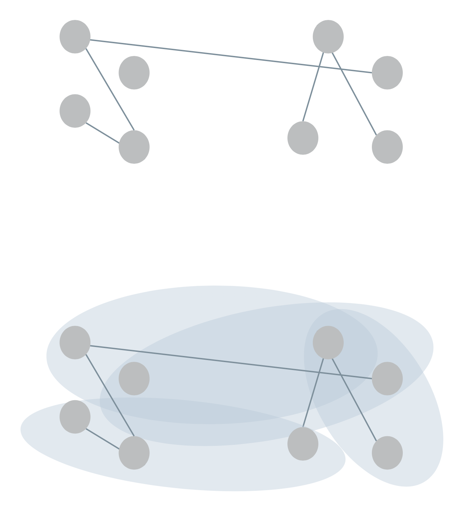
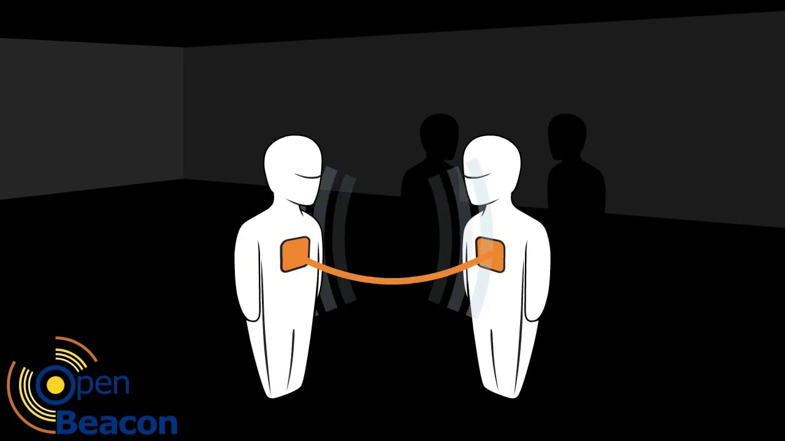
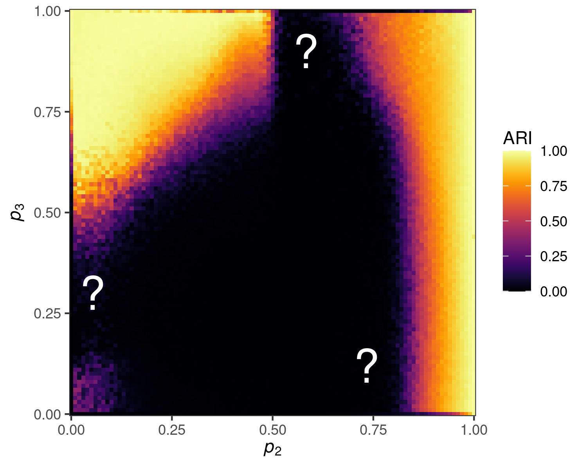

exclude: true   
<style type="text/css">
code.r{ 
  font-size: 16px; 
}
pre {
  font-size: 16px !important;  
}
</style>
```{r setup, include=FALSE}
options(htmltools.dir.version = FALSE)
```

---
class: bg-main1
layout: false


# Thoughts for today


<br>


---
class: bg-main1
layout: false


# Thoughts for today


<br>

### .alert[Feel] your feelings.


---
class: bg-main1
layout: false


# Thoughts for today


<br>

### .alert[Feel] your feelings.

### .alert[Fight] for the vulnerable.


---


class: bg-main1
layout: false


# Thoughts for today


<br>

### .alert[Feel] your feelings.

### .alert[Fight] for the vulnerable.

### .alert[Punch] fascists.*

<br> <br> 
*People who value control more than life. 

---

class: split-two
layout: false

.column.bg-main1[
.content[ 
  # Graphs and Hypergraphs 
 
  <br> 
  A .alert[graph] consists of a set of nodes $\mathcal{N}$ and a set of edges $\mathcal{E}$. Each edge in $\mathcal{E}$ is a set of two nodes. 

<br> <br> <br> <br> <br> <br>
  In .alert[hypergraphs], edges in $\mathcal{E}$ can contain *any number* of nodes.     
]

]

.column[
  .vmiddle[
  </img>
  ] 
]

---

class: split-two
layout: false

.column.bg-main1[
  
  # Hypergraph Data

  

]

.column.bg-main4[.vmiddle[
  <br>
]]


---

class: split-two
layout: false

.column.bg-main1[
  
  # Hypergraph Data

<br> <br> 

  .alert[**Interaction**]: nodes are agents, edges are interaction events (socializing in groups, attending events).
  

]

.column.bg-main4[.vmiddle[
  </img> 
]]

---

class: split-two
layout: false

.column.bg-main1[
  
  # Hypergraph Data

<br> <br> 

  .alert[**Interaction**]: nodes are agents, edges are interaction events (socializing in groups, attending events).
  <br>
  
  .alert[**Collaboration**]: nodes are collaborators, edges are projects or teams (scholarly papers, legislation, etc). 
  

]

.column.bg-main4[.vmiddle[
  </img> 
]]

---

class: split-two
layout: false

.column.bg-main1[
  
  # Hypergraph Data

<br> <br> 

  .alert[**Interaction**]: nodes are agents, edges are interaction events (socializing in groups, attending events).
  <br>

  .alert[**Collaboration**]: nodes are collaborators, edges are projects or teams (scholarly papers, legislation, etc). 
  <br>

  .alert[**Co-presence**]: nodes are chemical compounds, edges are drugs formed from those compounds.

]

.column.bg-main4[.vmiddle[
  </img>  
]]

---

class: split-two
layout: false

.column.bg-main1[.content[ 
  ## How would you generalize...
 
 ### ...the degree of a node? 
]]

.column[
  .vmiddle[
  </img>
  ] 
]

---

class: split-two
layout: false

.column.bg-main1[.content[ 
  ## How would you generalize...
 
 ### ...the degree of a node? 
 ### ...the adjacency matrix? 
]]

.column[
  .vmiddle[
  </img>
  ] 
]

---

class: split-two
layout: false

.column.bg-main1[.content[ 
  ## How would you generalize...
 
 ### ...the degree of a node? 
 ### ...the adjacency matrix? 
 ### ...triadic closure? 
]]

.column[
  .vmiddle[
  </img>
  ] 
]

---

class: split-two
layout: false

.column.bg-main1[.content[ 
  ## How would you generalize...
 
 ### ...the degree of a node? 
 ### ...the adjacency matrix? 
 ### ...triadic closure? 
 ### ....alert[modularity]? 
]]

.column[
  .vmiddle[
  </img>
  ] 
]


---

layout: false
class: split-two

.column.bg-main1[
  
  ### The Hypergraph Clustering Problem 
  <br>
    
  Given some hypergraph data, assign each node to a .alert[*cluster*] of related nodes. 
  <br> <br>
  Applications in social network analysis, drug discovery, image processing, data visualization...
  <br> <br> 
  Modularity is a handy way to do these kinds of problems, but how should it be generalized for hypergraphs?

  .footnote[
  One review in: <br> <b>PSC</b>, N. Veldt, A. R. Benson (2021). Generative hypergraph clustering: from blockmodels to modularity, <i>Science Advances</i>, 7:eabh1303
]

  
]
.column[.content.vmiddle[.stretch[
  
]]]

---

class: bg-main1 middle

## To find good generalizations, it helps to have .alert[multiple perspectives]. 

---

class: split-two

.column.bg-main1[
## Perspectives On Modularity

<br> <br> <br> 
$$Q(\mathbf{z}) \triangleq \frac{1}{2m}\sum_{ij \in N} \left[a_{ij} - \frac{k_ik_j}{2m}\right]\delta(z_i,z_j)$$
]

.column[
  <br> <br> <br> <br> <br> 
.alert[Perspective 1]: Compare entries of adjacency matrix $a_{ij}$ to entries of expected adjacency matrix $\frac{k_ik_j}{2m}$ under configuration model (used in another recent paper).

.alert[Perspective 2]: Compute the covariance of certain random variables associated with a random walk on the network (HW5). 

.alert[Perspective 3]: Construct a ***statistical model*** of a clustered graph and compute the ***likelihood*** of the data under this model. 


.footnote[Kamiński et al., "Clustering via hypergraph modularity." *PLoS ONE*, 2019]

]

---

class: split-two 

.column.bg-main1[

## Stochastic Blockmodel

Yet another random graph. 

Every node $i$ gets a *community* $z_i$ and an expected *degree* $c_i$. 

Additionally, we need an *affinity function* $\omega$ 

$$\omega(z_i, z_j) = \begin{cases} 
  \omega_{\mathrm{in}} &\quad z_i = z_j \\ 
  \omega_{\mathrm{out}} &\quad \text{otherwise.}
\end{cases}$$

Then, we place $A_{ij}$ edges between $i$ and $j$, where 

$$A_{ij} \sim \mathrm{Poisson}(c_ic_j\omega(z_iz_j)).$$

(*This is basically a bunch of Chung-Lu graphs with extra edges sprinkled between them.*)

]

.column[
  <br> <br> <br>
  </img>

  .footnote[Image from Abbe, E. (2017) "Community detection and stochastic block models: recent developments," *Journal of Machine Learning Research.*]
]

---

## The SBM Likelihood 

$$\mathbb{P}(\mathbf{A}|\mathbf{z}, \mathbf{c}) = \prod_{i < j}\frac{e^{-c_ic_j\omega_{z_iz_j}}(c_ic_j \omega(z_i,z_j))^{a_{ij}}}{a_{ij}!}\;.$$

.alert[Maximum Likelihood Principle]: A reasonable\* thing to do in this model is to find communities $\mathbf{z}$ and expected degree parameters $\mathbf{c}$ that make $\mathbb{P}$ large. Then, 

$\mathbf{c} \approx \mathbf{k}$ is a good choice for the expected degrees, and  

$$\log \mathbb{P}(\mathbf{A}|\mathbf{z}, \mathbf{k}) = \beta\sum_{ij} \left[a_{ij} - \gamma \frac{k_i k_j}{2m} \right] \delta(z_i, z_j) + K$$

- $\beta = \log \omega_{\mathrm{in}} - \log \omega_{\mathrm{out}}$ 
- $\gamma = \frac{\omega_{\mathrm{in}} -  \omega_{\mathrm{out}}}{\beta}$
- $K$ doesn't depend on $\mathbf{z}$. 

.footnote[\*Terms and conditions apply.]

---

## Modularity as Maximum Likelihood

<br> 

*Approximate maximum likelihood inference in the SBM* is the same as maximizing a generalized modularity: 

$$Q_\gamma(\mathbf{z}) = \frac{1}{2m}\sum_{ij} \left[a_{ij} - \gamma \frac{k_i k_j}{2m} \right] \delta(z_i, z_j)\;.$$

$\gamma$ here is a *resolution parameter* that allows $Q_\gamma$ to find smaller communities than the resolution threshold normally permits (allow $\gamma$ to be large). 

.footnote[
  Newman, "Equivalence between modularity optimization and maximum likelihood methods for community detection." *PRE*, 2016
]

---

layout: false
class: split-two

.column.bg-main1[
  ### The Hypergraph Clustering Problem 

<br><br> 
  Given some hypergraph data, assign each node to a .alert[*cluster*] of "related" nodes. 
  <br> <br>
  Applications in social network analysis, drug discovery, image processing, data visualization...
  <br> <br> 
  Modularity is a handy way to do these kinds of problems, but how should it be generalized for hypergraphs?

  .footnote[
  One review in: <br> <b>PSC</b>, N. Veldt, A. R. Benson (2021). Generative hypergraph clustering: from blockmodels to modularity, <i>Science Advances</i>, 7:eabh1303
]

  
]
.column[.content.vmiddle[.stretch[
  
]]]


---

class: split-two 
layout: false

.column.bg-main1[

<br> <br>
### Motivation 

I want to do modularity maximization for hypergraph Big Data® with suspected cluster structure. 

### I need: 

- A definition of modularity. 
- A fast algorithm. 

]

.column[.stretch[ 
     
]]

---
class: split-50 bg-main1 
layout: false 
 
.row[ 
.split-three[
.column[<br><br>
   
  ]
.column[<br><br>
   
]
.column[<br><br>
     
] 

]
]
.row[ 
.split-three[
.column[<br>
  .font_large[.alert-no-bold[<nobr>Nate Veldt</nobr>]]
  <nobr>Computer Science</nobr> <br> Texas A&M      
  .alert2[@n_veldt]
]  
.column[<br>
  .font_large[.alert-no-bold[<nobr>Austin Benson</nobr>]]
   Computer Science <br> Cornell      
   .alert2[@austinbenson]
]
.column[<br>
  .font_large[.alert-no-bold[<nobr>Phil Chodrow</nobr>]]
  <nobr>Mathematics</nobr> <br> UCLA
  <br> .alert2[@PhilChodrow] <br>
]
]
]

<br> <br> <br> <br> <br> <br> <br> <br> <br> <br> <br> <br> <br> <br> <br> <br> <br> <br> <br> <br> 
Always thank your team!

---

class: split-two
layout: false

.column[ 
  ### Hypergraph Stochastic Blockmodel
  
]

.column.bg-main1[


.font_smaller[

### &nbsp; <br>  &nbsp;  
1. Give each node $i$ a cluster label $z_i$ and a degree-weight $\theta_i$ (higher weight $\implies$ more hyperedges involving that node).
2. For each tuple $R$ of nodes, sample a random number of edges:
$$a_R \sim \mathrm{Poisson}\left(\Omega(\mathbf{z}_R)\prod_{i \in R}c_i\right)$$

Here, $\Omega$ is an *affinity function* that encodes which combinations of groups are likely to form hyperedges. 
]

.footnote[
Bernoulli variant proposed by Ke et al (2019), 	
Community detection for hypergraph networks via regularized tensor power iteration, *arXiv:*:1909.06503
]
]

---

class: split-two
layout: 

.column.bg-main1[
### The Affinity Function $\Omega$

<br> 

$$a_R \sim \mathrm{Poisson}\left(\Omega(\mathbf{z}_R)\prod_{i \in R}c_i\right)$$

$\Omega$ controls how hyperedges form in response to node labels. 

Let's focus on the .alert[All-Or-Nothing] affinity.

This models the idea that edges form most frequently when nodes have the same labels. 


]

.column[

### <br>

<br> <br>

Let $e$ be a hyperedge of size $k$: 

$$\Omega(\mathbf{z}_e) = \begin{cases}
  \omega_{k,\mathrm{in}} &\quad e \text{ has all same labels} \\ 
  \omega_{k, \mathrm{out}} &\quad \text{otherwise}\;.  
\end{cases}$$

<br>

$$\Omega(\color{#ff5252}{\bullet} \color{#ff5252}{\bullet} \color{#ff5252}{\bullet}) > \Omega(\color{#ff5252}{\bullet} \color{#ff5252}{\bullet} \color{#FFD046}{\bullet})= \Omega(\color{#ff5252}{\bullet} \color{#FFD046}{\bullet} \color{#6ec0de}{\bullet})\ldots$$ 
]

---

## Lots of algebra later...

...we get a modularity function for hypergraphs! 

$$Q \triangleq \sum_k \color{#ff5252}{\beta_k} \left[(\text{# homogeneous }k\text{-edges}) - \color{#21728f}{\gamma_k}\sum_{\ell} (\text{total degrees in cluster } \ell)^k\right]$$

$\color{#ff5252}{\beta_k} \triangleq \log \omega_{k1} - \log \omega_{k0}$ is the *relative importance* of edges of size $k$.  <br>
$\color{#21728f}{\gamma_k} \triangleq \frac{1}{\beta_k}(\omega_{k1} - \omega_{k0})$ is the resolution parameter for edges of size $k$.

*Compare this to:* 

$$Q = \sum_{\ell} \left[e_\ell - f_\ell^2\right] \tag{from class}$$

where $e_\ell$ is the fraction of edges contained in community $\ell$ and $f_\ell$ is the fraction of node degrees contained in $\ell$. 


.footnote[
Generalizes Kamiński et al., "Clustering via hypergraph modularity." *PLoS One*, 2019] 

---

class: split-two

.column.bg-main1[

### Hypergraph Maximum-Likelihood Louvain Algorithm

<br>

1. All nodes start in their own cluster. 
2. Greedily .alert[merge] nodes to maximize $Q$. 
3. Then, greedily merge .alert[entire clusters] of nodes.  
4. Estimate parameters $\omega$ and $\{c_i\}$.
5. Repeat!

- Extends Louvain algorithm for graphs.
- Lots of small tricks to make this .alert[wicked fast]. 
- Experiments on hypergraphs with millions of nodes -- no problem! 


.footnote[Blondel et al. "Fast unfolding of communities in large networks." *J. Stat. Mech.*, 2008]
]

.column[ 
  
  <br>
  
  
  .footnote[Image from Traag et al., "From Louvain to Leiden: guaranteeing well-connected communities," *Scientific Reports*, 2019]
]

---

### .alert[Empirical data]: school contact hypergraphs. 

<br> 
.center[]

Cluster labels are classes in a primary school and a high school (in France). 

*We used this data for link prediction last week.*


.footnote[
Stehlé et al. (*PLoS ONE*, 2011) and Mastrandrea et al. (*PLoS ONE*, 2015)
]

---

background-image: url(../img-lib/contact-clustering.png)
background-size: contain

---

class: split-two
layout: false

.column[

## This doesn't **always** work well...

<br> 
   
]

.column[.stretch[ 

<br> <br> <br> <br> <br> 

<br>
   

Adjusted Rand Index (ARI): 

- ARI = 1: perfect clustering. 
- ARI = 0: random noise.

]]

---

class: split-two 

.column[
  ## But that's the next paper!

  .stretch[
.center[ <br>

]
]
]

.column[
 .stretch[
.center[ <br>
 
]
]
]

---

class: bg-main1 middle

## To find good generalizations, it helps to have .alert[multiple perspectives].  

---

class: bg-main1

# Thoughts for today


<br>

### .alert[Feel] your feelings.

### .alert[Fight] for the vulnerable.

### .alert[Punch] fascists.
